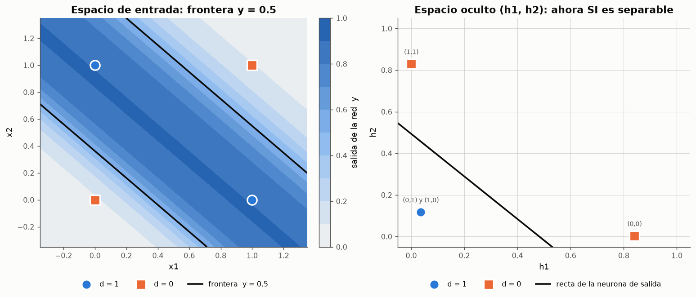
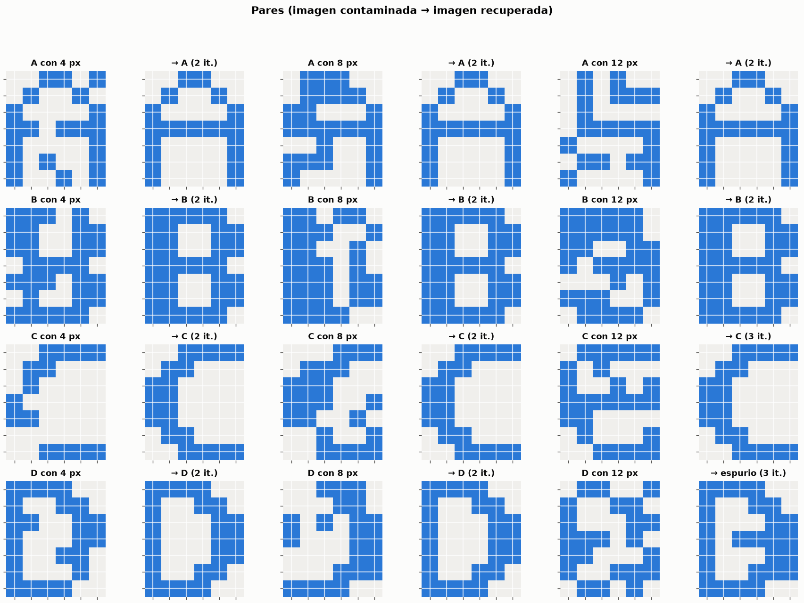

# Redes Neuronales Artificiales desde cero

Implementacion **desde cero**, sin librerias de aprendizaje automatico, de los modelos
neuronales de la asignatura *Introduccion a la Computacion Emergente*
(Prof. Esteban Alvarez): la neurona de **McCulloch-Pitts** y las compuertas logicas
AND y OR, el **perceptron simple** de una capa, el **ADALINE** con la regla Delta, la
**regla de Hebb**, el **perceptron multicapa** con retropropagacion, los **mapas
autoorganizados de Kohonen** y la **red de Hopfield**. Cubre las seis actividades de la
*Evaluacion de Redes Neuronales Artificiales* (ver [tabla de correspondencia](#la-evaluacion-actividad-por-actividad)).

Las unicas dependencias son `numpy`, `pandas` y `matplotlib`. Toda la maquinaria
neuronal --- propagacion, reglas de aprendizaje, criterios de parada, metricas y
diagramas de red --- esta escrita a mano y documentada linea a linea.

```bash
python3 -m pip install -r requirements.txt
python3 experimentos/ejecutar_todo.py     # regenera 65 figuras, 74 tablas y 12 informes (~5 min)
python3 pruebas/pruebas.py                # 40 pruebas, sin dependencias externas
```

---

## Que hay aqui

| Modelo | Ano | Que aporta | Modulo | Documentacion |
|---|---|---|---|---|
| **McCulloch-Pitts** | 1943 | Neurona binaria de umbral **fijo**; compuertas AND y OR; universalidad por composicion | [`mcculloch_pitts.py`](ce_rna/mcculloch_pitts.py) | [doc 01](docs/01_mcculloch_pitts.md) |
| **Regla de Hebb** | 1949 | Aprendizaje de **una sola pasada** por correlacion | [`hebb.py`](ce_rna/hebb.py) | [doc 04](docs/04_regla_hebb.md) |
| **Perceptron simple** | 1958 | Primera red **que aprende**; regla de correccion de error con teorema de convergencia | [`perceptron.py`](ce_rna/perceptron.py) | [doc 02](docs/02_perceptron_simple.md) |
| **ADALINE** | 1960 | Salida **real**; regla Delta = descenso del gradiente sobre el error cuadratico medio | [`adaline.py`](ce_rna/adaline.py) | [doc 03](docs/03_adaline.md) |
| **Perceptron multicapa** | 1986 | Capas ocultas sigmoidales entrenadas con **retropropagacion**; resuelve el XOR y aproxima funciones | [`perceptron_multicapa.py`](ce_rna/perceptron_multicapa.py) | [doc 06](docs/06_perceptron_multicapa.md) |
| **Mapa de Kohonen** | 1982 | Aprendizaje **no supervisado** competitivo con vecindad; descubre grupos | [`kohonen.py`](ce_rna/kohonen.py) | [doc 07](docs/07_kohonen.md) |
| **Red de Hopfield** | 1982 | **Memoria asociativa** recurrente; recupera imagenes contaminadas | [`hopfield.py`](ce_rna/hopfield.py) | [doc 08](docs/08_hopfield.md) |

Los cuatro primeros comparten la misma arquitectura unicapa; lo unico que cambia entre
ellos es **como se calcula `Δw`**. El perceptron multicapa anade capas ocultas y reparte
el error hacia atras; Kohonen y Hopfield cambian de paradigma: el primero aprende sin
salida deseada y el segundo no clasifica sino que *recuerda*.

---

## La evaluacion, actividad por actividad

| Actividad | Enunciado | Donde esta |
|---|---|---|
| 1 | McCulloch-Pitts (AND, OR) y perceptron simple | experimentos [01](resultados/reportes/01_mcculloch_pitts.md), [02](resultados/reportes/02_perceptron_and_or.md), [03](resultados/reportes/03_perceptron_xor.md), [04](resultados/reportes/04_perceptron_letras.md) |
| 2 | ADALINE y regla Delta: descodificador binario-decimal | experimentos [05](resultados/reportes/05_adaline_decodificador.md), [06](resultados/reportes/06_perceptron_vs_adaline.md) |
| 3 | Perceptron multicapa: XOR (2-2-1) y aproximacion de funciones | experimentos [08](resultados/reportes/08_mlp_xor.md), [09](resultados/reportes/09_mlp_aproximacion.md) |
| 4 | Mapas autoorganizados de Kohonen: grupos en el plano | experimento [10](resultados/reportes/10_kohonen.md) |
| 5 | Red de Hopfield: letras A, B, C, D de 7x6 pixeles con ruido | experimento [11](resultados/reportes/11_hopfield.md) |
| 6 | Seminario de investigacion sobre un articulo | [docs/09](docs/09_seminario_investigacion.md): Baldi, Sadowski y Whiteson (2014), *Nature Communications* 5, 4308 |

---

## Los doce experimentos

Cada experimento es un script ejecutable que produce figuras, tablas CSV y un informe
en Markdown **generado automaticamente** a partir de la misma ejecucion que produce
los numeros.

| # | Experimento | Pregunta | Informe |
|---|---|---|---|
| 00 | Funciones de activacion | ¿Cuales son derivables y por que importa? | [ver](resultados/reportes/00_activaciones.md) |
| 01 | McCulloch-Pitts: AND y OR | ¿Puede una neurona de umbral calcular AND, OR y XOR? | [ver](resultados/reportes/01_mcculloch_pitts.md) |
| 02 | Perceptron: AND y OR | ¿Puede una red aprender los pesos por si sola? | [ver](resultados/reportes/02_perceptron_and_or.md) |
| 03 | Perceptron: el XOR | ¿Por que falla, y de quien es la culpa? | [ver](resultados/reportes/03_perceptron_xor.md) |
| 04 | Perceptron: letras X y O | ¿Funciona sobre reconocimiento real con ruido? | [ver](resultados/reportes/04_perceptron_letras.md) |
| 05 | ADALINE: descodificador binario-decimal | ¿Puede aproximar una funcion de salida real? | [ver](resultados/reportes/05_adaline_decodificador.md) |
| 06 | Perceptron frente a ADALINE | ¿Que gana y que pierde cada uno? | [ver](resultados/reportes/06_perceptron_vs_adaline.md) |
| 07 | Regla de Hebb | ¿Hasta donde llega el aprendizaje de una sola pasada? | [ver](resultados/reportes/07_regla_hebb.md) |
| 08 | Perceptron multicapa: XOR | ¿Aprende una capa oculta lo que el perceptron no puede? | [ver](resultados/reportes/08_mlp_xor.md) |
| 09 | Perceptron multicapa: aproximacion | ¿Cuantas neuronas ocultas hacen falta, y cuando parar? | [ver](resultados/reportes/09_mlp_aproximacion.md) |
| 10 | Mapas de Kohonen | ¿Descubre el mapa los grupos sin que se los digan? | [ver](resultados/reportes/10_kohonen.md) |
| 11 | Red de Hopfield | ¿Recupera letras contaminadas con ruido, y cuando falla? | [ver](resultados/reportes/11_hopfield.md) |

---

## Algunos resultados

### Las compuertas AND y OR como neuronas de umbral

<p align="center">
  
  
</p>

Pesos `(1, 1)` y umbral `θ = 2` para el AND; `(2, 2)` y `θ = 2` para el OR. Ambas
tablas de verdad se reproducen exactamente, y ambas fronteras son rectas: los dos
problemas son **linealmente separables**.

### El XOR: donde se rompe la red unicapa

<p align="center">
  
  
</p>

Una busqueda exhaustiva sobre **68 921 rectas** confirma que el maximo alcanzable
sobre el XOR es 3 patrones de 4. El algoritmo perceptronico nunca se detiene. La
solucion no es cambiar la regla de aprendizaje sino **anadir una capa**: componiendo
tres neuronas (`OR ∧ ¬AND`) el XOR sale exacto.

### El perceptron aprende, y encuentra una solucion entre infinitas

<p align="center">
  
  
</p>

Cada correccion rota y desplaza el hiperplano. Con sesenta inicializaciones distintas
se obtienen sesenta fronteras validas distintas: *"o no existe ninguna solucion, o
existen infinitas"*.

### Lo que la red memoriza son plantillas

<p align="center">
  
</p>

Los pesos de la red de letras, vistos como imagen de 5x5. Un detalle que el informe
documenta y que contradice la intuicion: cada neurona no almacena su propia letra sino
la **anti-plantilla de su rival** --- porque el perceptron aprende lo primero que
resuelve el problema, no lo que uno espera encontrar.

### El ADALINE desciende por un paraboloide

<p align="center">
  
  
</p>

Sobre el descodificador binario-decimal, la red recupera los pesos `(0, 4, 2, 1)` ---
los valores posicionales de los bits --- con un error cuadratico medio de `3e-17` y
R² = 1. La superficie de error es convexa: un unico minimo, sin minimos locales.

### La capa oculta crea un espacio donde el XOR es separable

<p align="center">
  
</p>

La red 2-2-1 aprende por retropropagacion una frontera curva en el plano de entrada; en
el espacio de las neuronas ocultas los patrones (0,1) y (1,0) colapsan en un mismo punto
y una recta basta. Con 50 inicializaciones, ~10 % queda en un minimo local.

### Aproximacion de funciones con sigmoides

<p align="center">
  
</p>

f(x) = sin x + 0.5 sin 3x con una red 1-8-1: R² ≈ 0.9999 sobre puntos no vistos. Con
menos de ~8 neuronas ocultas el armonico no aparece.

### Kohonen: los grupos emergen sin etiquetas

<p align="center">
  
</p>

Un mapa de 10x10 se despliega sobre 400 puntos y su matriz U revela los cinco grupos con
pureza ≈ 0.99, sin haber visto ninguna etiqueta.

### Hopfield: memoria asociativa y diseno de patrones

<p align="center">
  
</p>

Las cuatro letras de 7x6 son atractores; con 8 de 42 pixeles invertidos la red recupera
la letra correcta en ~87 % de los casos.

---

## Hallazgos que merecen destacarse

Los informes registran los resultados tal como salieron, incluidos los que contradicen
la version habitual de los manuales:

- **Con pesos iniciales nulos, la razon de aprendizaje del perceptron es irrelevante.**
  Todos los pesos quedan multiplicados por `a`, y la frontera `w·x = 0` no cambia.
- **Entrenar con ejemplos ruidosos empeora el reconocimiento de letras.** Entrenado
  solo con los prototipos limpios, el perceptron produce el filtro adaptado, que es
  optimo; el ruido lo desvia a otra solucion valida pero peor.
- **Sobre AND y OR, el ADALINE converge a la misma frontera que el perceptron.** La
  solucion de minimos cuadrados del AND bipolar es exactamente proporcional a la del
  perceptron: con cuatro patrones simetricos no hay ninguna diferencia que medir.
- **Sobre 60 patrones dispersos, la solucion de minimos cuadrados clasifica peor.**
  Tiene margen negativo mientras el perceptron separa todos los patrones: minimizar el
  error cuadratico **no** es lo mismo que separar clases.
- **La regla de Hebb falla en el AND binario** --- los aportes se cancelan y los pesos
  quedan en cero --- y funciona en el bipolar. La codificacion decide entre funcionar
  y no funcionar.
- **El dibujo "natural" de las letras B, C y D no se puede almacenar en Hopfield con la
  regla de Hebb**, aunque 4 patrones esten por debajo de la capacidad teorica (5.8):
  se solapan hasta 0.62 y dejan de ser puntos fijos. Redisenarlas con trazo grueso
  (solapamiento ≤ 0.33) o usar la regla de la pseudoinversa lo resuelve.
- **Algunos estados espurios de Hopfield son valles mas profundos que las letras.**
  Lo que los hace raros con poco ruido es el tamano de su cuenca, no su profundidad.
- **Clasificar bien el XOR llega mucho antes que un error pequeno**: con E ≤ 0.05 las
  cuatro clases ya son correctas, pero las salidas estan a 0.3 de la frontera.
- **Sin vecindad no hay mapa**: un Kohonen sin cooperacion cuantiza mejor, pero su
  error topografico sube de ~0.01 a ~0.95 y la matriz U ya no revela los grupos.

---

## Estructura

```
ce_rna/            El paquete: modelos, metricas, figuras e informes
experimentos/      Doce scripts ejecutables, uno por estudio
pruebas/           40 pruebas de propiedades matematicas, sin pytest
docs/              Documentacion teorica y de la API
clases/            Material original de la asignatura
resultados/        Figuras, tablas CSV e informes generados
```

- [00 --- Fundamentos: el modelo de neurona y el vocabulario](docs/00_fundamentos.md)
- [01 --- McCulloch-Pitts y las compuertas logicas](docs/01_mcculloch_pitts.md)
- [02 --- El perceptron simple](docs/02_perceptron_simple.md)
- [03 --- ADALINE y la regla Delta](docs/03_adaline.md)
- [04 --- La regla de Hebb](docs/04_regla_hebb.md)
- [05 --- Guia de uso y referencia de la API](docs/05_guia_de_uso.md)
- [06 --- El perceptron multicapa y la retropropagacion](docs/06_perceptron_multicapa.md)
- [07 --- Mapas autoorganizados de Kohonen](docs/07_kohonen.md)
- [08 --- La red de Hopfield como memoria asociativa](docs/08_hopfield.md)
- [09 --- Seminario de investigacion (Actividad 6)](docs/09_seminario_investigacion.md)

---

## Uso como libreria

```python
from ce_rna import datasets as ds
from ce_rna.perceptron import PerceptronSimple
from ce_rna.adaline import Adaline

# Perceptron sobre la compuerta AND
conjunto = ds.compuerta("AND", "bipolar")
red = PerceptronSimple(n_entradas=2, razon_aprendizaje=1.0).entrenar(conjunto.X, conjunto.d)
print(red.resumen())
print(red.predecir(conjunto.X))          # [-1. -1. -1.  1.]

# ADALINE sobre el descodificador de 3 bits
conjunto = ds.decodificador_binario(3)
red = Adaline(3, razon_aprendizaje=0.05, max_epocas=1000, tolerancia=1e-9)
red.entrenar(conjunto.X, conjunto.d)
print(red.w)                             # ~ [0. 4. 2. 1.]
```

---

## Verificacion

La bateria de [`pruebas/pruebas.py`](pruebas/pruebas.py) comprueba propiedades
**matematicas**, no solo que el codigo no reviente:

- las compuertas MCP reproducen sus tablas de verdad, y **ninguna** neurona de umbral
  resuelve el XOR;
- el perceptron converge en todo problema separable y no converge en el XOR;
- si el perceptron acierta, los pesos no cambian (paso 4 del algoritmo);
- la regla Delta alcanza la solucion exacta de minimos cuadrados;
- el gradiente implementado coincide con la derivada numerica del error (`1e-6`);
- las derivadas de las activaciones coinciden con sus diferencias finitas;
- la regla de Hebb falla en el AND binario y funciona en el bipolar;
- la retropropagacion coincide con el gradiente numerico y la red 2-2-1 resuelve el XOR;
- el mapa de Kohonen separa los cinco grupos y preserva la topologia;
- las letras son puntos fijos de la red de Hopfield y la energia nunca aumenta.

```
40 de 40 pruebas superadas
```

---

## Creditos

Material teorico y ejercicios: **Prof. Esteban Alvarez**, asignatura *Introduccion a
la Computacion Emergente → Redes Neuronales Artificiales*. Las transcripciones de las
clases estan en [`clases/`](clases/) y todos los modulos citan la lamina concreta que
implementan.

Licencia [MIT](LICENSE).
