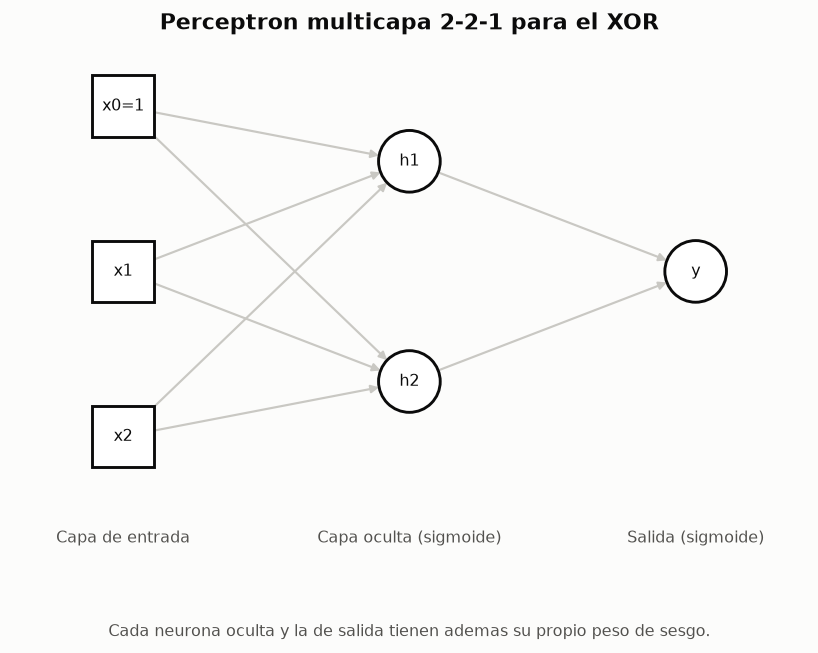
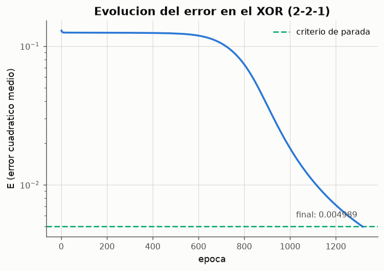
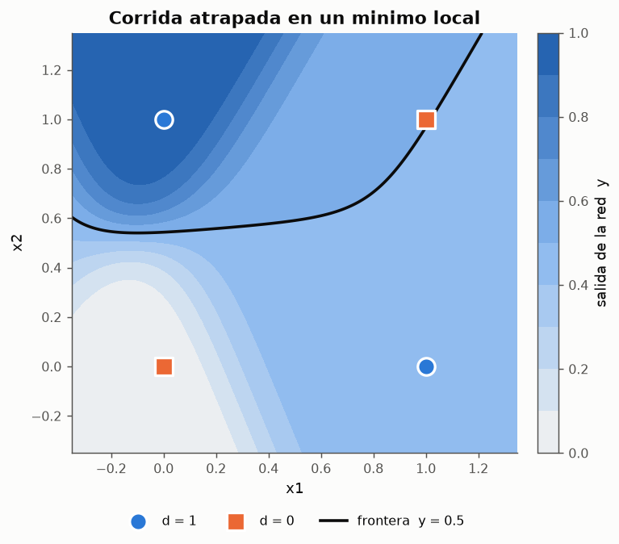
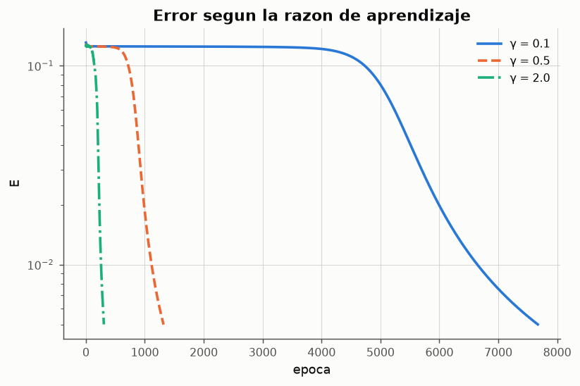

# Experimento 08 --- Perceptron multicapa: el XOR con retropropagacion

> Informe generado automaticamente por los scripts de `experimentos/` el 2026-09-28 11:39.
> No editar a mano: se regenera con `python experimentos/ejecutar_todo.py`.

El XOR es el ejemplo clasico de problema **no linealmente separable**: el experimento 03 comprobo que ninguna de 68 921 rectas clasifica sus cuatro patrones y que el perceptron simple oscila indefinidamente. La salida es anadir una **capa oculta** de neuronas no lineales. Este experimento entrena la arquitectura 2-2-1 presentada en clase con retropropagacion del error, verifica la tabla del XOR, muestra que representa la capa oculta y estudia como influyen la razon de aprendizaje, el numero de neuronas ocultas, el momento y el criterio de parada.

## 1. Arquitectura y codificacion

**Patrones del XOR (codificacion binaria)**

| x1 | x2 | y |
|---|---|---|
| 0 | 0 | 0 |
| 0 | 1 | 1 |
| 1 | 0 | 1 |
| 1 | 1 | 0 |

*Datos completos: [`08_patrones_xor.csv`](../tablas/08_patrones_xor.csv)*

Se usa la codificacion **binaria** {0, 1} porque la sigmoide logistica tiene recorrido (0, 1): los objetivos 0 y 1 son sus asintotas. La salida se interpreta como clase 1 si y ≥ 0.5.

- **Capa de entrada**: 2 unidades (x1, x2), que solo distribuyen la senal.
- **Capa oculta**: 2 neuronas sigmoidales con sesgo. Es el minimo que resuelve el XOR: cada neurona oculta traza una recta, y dos rectas bastan para aislar la franja que contiene (0,1) y (1,0).
- **Capa de salida**: 1 neurona sigmoidal con sesgo.
- Total: 2·(2+1) + 1·(2+1) = **9 pesos** ajustables.

Propagacion hacia adelante (con y_0 = 1 como entrada de sesgo en cada capa):

$$
v_j^{(l)} = \sum_{i} w_{ji}^{(l)}\, y_i^{(l-1)}, \qquad y_j^{(l)} = \varphi\!\left(v_j^{(l)}\right) = \frac{1}{1+e^{-v_j^{(l)}}}
$$

Funcion de error y retropropagacion (regla Delta generalizada):

$$
E = \frac{1}{N}\sum_{p}\tfrac{1}{2}\sum_k \left(d_k^{p}-y_k^{p}\right)^2
$$

$$
\delta_k^{(L)} = (d_k - y_k)\,y_k(1-y_k), \qquad \delta_j^{(l)} = y_j^{(l)}\left(1-y_j^{(l)}\right)\sum_k \delta_k^{(l+1)} w_{kj}^{(l+1)}
$$

$$
\Delta w_{ji}^{(l)}(t) = \gamma\,\delta_j^{(l)}\,y_i^{(l-1)} + \alpha\,\Delta w_{ji}^{(l)}(t-1)
$$

La derivada de la sigmoide se expresa con su propia salida, φ'(v) = y(1 − y); por eso la sigmoide es la activacion de referencia para backpropagation: es derivable en todo punto (el escalon no lo es) y su derivada es barata de calcular.



*Figura: Arquitectura 2-2-1.*

## 2. Entrenamiento y resultados

Parametros: γ = 0.5, sin momento, modo estocastico (actualizacion tras cada patron, orden barajado en cada epoca), pesos iniciales uniformes en [−1, 1] (semilla 0). Criterio de parada: E ≤ 0.005 (equivale a un error tipico de ~0.1 por patron) o 10000 epocas.

**Tabla de resultados del XOR tras el entrenamiento**

| x1 | x2 | d | h1 | h2 | y (salida real) | clase (y>=0.5) | error d-y |
|---|---|---|---|---|---|---|---|
| 0 | 0 | 0 | 0.84073 | 0.00364931 | 0.0860579 | 0 | -0.0860579 |
| 0 | 1 | 1 | 0.0361519 | 0.118088 | 0.896237 | 1 | 0.103763 |
| 1 | 0 | 1 | 0.0364029 | 0.117959 | 0.896161 | 1 | 0.103839 |
| 1 | 1 | 0 | 0.000268363 | 0.830194 | 0.104674 | 0 | -0.104674 |

*Datos completos: [`08_tabla_xor.csv`](../tablas/08_tabla_xor.csv)*

```text
MLP 2-2-1 | gamma = 0.5, alpha = 0, modo estocastico | 9 pesos
epocas usadas: 1318 | parada: error_objetivo | E final = 4.989e-03
```

**Pesos aprendidos (para 'y', w1 y w2 conectan con h1 y h2)**

| neurona | w0 (sesgo) | w1 | w2 |
|---|---|---|---|
| h1 | 1.66367 | -4.9397 | -4.94687 |
| h2 | -5.60956 | 3.59766 | 3.5989 |
| y | 3.14419 | -6.52253 | -6.37053 |

*Datos completos: [`08_pesos_xor.csv`](../tablas/08_pesos_xor.csv)*



*Figura: El error permanece casi constante en una meseta y despues cae bruscamente: es el momento en que las neuronas ocultas se especializan.*

La curva tiene la forma tipica de backpropagation sobre el XOR: una **meseta** inicial (E ≈ 0.130, la red responde ≈ 0.5 a todo porque es lo que minimiza el error mientras las ocultas son redundantes) que dura hasta la epoca ~627, seguida de una caida rapida. En la meseta el gradiente es pequeno pero no nulo, y el descenso termina por romper la simetria entre las dos neuronas ocultas.

## 3. Que aprendio la capa oculta


*Figura: Izquierda: la frontera aprendida en el plano (x1, x2) ya no es una recta. Derecha: los mismos cuatro patrones vistos por la neurona de salida.*

Umbralizando las neuronas ocultas en 0.5 sobre los patrones (0,0), (0,1), (1,0), (1,1): **h1** → [1, 0, 0, 0] (≈ NOR); **h2** → [0, 0, 0, 1] (≈ AND). La red ha redescubierto por si sola la descomposicion que el experimento 01 impuso a mano, XOR = OR ∧ ¬AND (o una equivalente): la capa oculta calcula dos funciones linealmente separables y la de salida las combina. En el espacio oculto los patrones (0,1) y (1,0) colapsan en la misma esquina y una sola recta los separa de los otros dos.

## 4. Minimos locales: no toda inicializacion converge

Se repitio el entrenamiento con 50 inicializaciones distintas (mismos parametros). Convergieron **90 %**; el resto agoto las 10000 epocas atrapado en un **minimo local** de la superficie de error.

**Resumen de las 50 corridas**

| estadistico | epocas | E_final |
|---|---|---|
| mean | 2370.22 | 0.0111822 |
| min | 868 | 0.00498524 |
| 50% | 1416.5 | 0.00499261 |
| max | 10000 | 0.0836051 |

*Datos completos: [`08_semillas_xor.csv`](../tablas/08_semillas_xor.csv)*

Ejemplo de corrida fallida: salidas 0.018, 0.982, 0.499, 0.500 (E = 0.0627). La red clasifica bien dos patrones y responde ≈ 0.5 a los otros dos: una neurona oculta se satura y deja de aportar gradiente, y la red queda con una sola frontera util --- justo lo que un perceptron simple podria hacer. El descenso por el gradiente es un metodo **local**: solo ve la pendiente donde esta, y no garantiza el minimo global.



*Figura: Con una sola neurona oculta util, la frontera vuelve a ser practicamente una recta.*

## 5. Estudio de parametros

Cada configuracion se entrena con 20 inicializaciones distintas. Se considera exito alcanzar E ≤ 0.005 con los cuatro patrones bien clasificados; las epocas se resumen solo sobre las corridas exitosas.

### 5.1 Razon de aprendizaje γ

**Efecto de la razon de aprendizaje (2-2-1, sin momento)**

| gamma | exito_% | epocas_mediana | epocas_min | epocas_max |
|---|---|---|---|---|
| 0.1 | 65 | 5862 | 4352 | 9830 |
| 0.25 | 85 | 2597 | 1737 | 5076 |
| 0.5 | 85 | 1361 | 868 | 2567 |
| 1 | 80 | 840.5 | 441 | 1519 |
| 2 | 80 | 468 | 245 | 1982 |
| 4 | 70 | 276 | 156 | 3356 |

*Datos completos: [`08_gamma.csv`](../tablas/08_gamma.csv)*



*Figura: Con γ pequeno la meseta se alarga; con γ grande la caida llega antes.*

γ fija el tamano de cada paso del descenso por el gradiente. Las epocas necesarias son aproximadamente inversamente proporcionales a γ: la meseta se recorre a velocidad proporcional al paso. Con γ = 0.1 la tasa de exito baja sobre todo porque muchas corridas **agotan las 10000 epocas** antes de salir de la meseta, no porque caigan en un minimo peor. Con γ muy grande (4) los pesos crecen deprisa, las sigmoides se saturan (φ' ≈ 0), aparecen corridas muy largas y la tasa de exito vuelve a bajar. El rango 0.5-2 ofrece el mejor compromiso.

### 5.2 Numero de neuronas ocultas

**Efecto del tamano de la capa oculta (γ = 0.5)**

| neuronas_ocultas | pesos | exito_% | epocas_mediana | epocas_min | epocas_max |
|---|---|---|---|---|---|
| 2 | 9 | 85 | 1361 | 868 | 2567 |
| 3 | 13 | 100 | 1173 | 672 | 2410 |
| 4 | 17 | 95 | 1085 | 738 | 2472 |
| 8 | 33 | 100 | 886 | 679 | 1095 |

*Datos completos: [`08_ocultas.csv`](../tablas/08_ocultas.csv)*

Dos neuronas ocultas son suficientes pero es la configuracion mas fragil: si una de las dos se desperdicia, no hay repuesto. Con mas neuronas ocultas hay mas formas de repartir el trabajo, la superficie de error tiene menos minimos locales problematicos y la tasa de exito sube; a cambio hay mas pesos que ajustar. Para un problema de cuatro patrones no hay riesgo de sobreajuste --- todos los patrones posibles estan en el entrenamiento ---, asi que aqui la capacidad extra solo aporta robustez.

### 5.3 Momento y modo de actualizacion

**Momento y modo de actualizacion**

| configuracion | exito_% | epocas_mediana | epocas_min | epocas_max |
|---|---|---|---|---|
| estocastico, α = 0.0 | 85 | 1361 | 868 | 2567 |
| estocastico, α = 0.5 | 85 | 747 | 436 | 1273 |
| estocastico, α = 0.9 | 90 | 192.5 | 95 | 1785 |
| lote, α = 0, γ = 2 | 90 | 1307 | 874 | 2544 |
| lote, α = 0.9, γ = 2 | 85 | 168 | 103 | 328 |

*Datos completos: [`08_momento.csv`](../tablas/08_momento.csv)*

El momento α acumula una fraccion del paso anterior: en las mesetas, donde el gradiente apunta siempre en la misma direccion, el paso efectivo crece hasta γ/(1 − α), y la red sale antes. En modo por lotes se da un unico paso por epoca con el gradiente exacto de E; como cada epoca aporta 4 veces menos actualizaciones que el modo estocastico, necesita un γ mayor para avanzar al mismo ritmo.

### 5.4 Criterio de parada

**Umbral de error como criterio de parada**

| E_objetivo | epocas | clasifica_4 | max_|d-y| | y(0,0) | y(0,1) | y(1,0) | y(1,1) |
|---|---|---|---|---|---|---|---|
| 0.05 | 862 | True | 0.367851 | 0.235835 | 0.676965 | 0.676429 | 0.367851 |
| 0.02 | 987 | True | 0.218081 | 0.158539 | 0.790925 | 0.791562 | 0.218081 |
| 0.005 | 1318 | True | 0.104674 | 0.0860579 | 0.896237 | 0.896161 | 0.104674 |
| 0.001 | 2588 | True | 0.0466343 | 0.0400806 | 0.953376 | 0.953366 | 0.0451961 |

*Datos completos: [`08_criterio_parada.csv`](../tablas/08_criterio_parada.csv)*

La clasificacion correcta (y del lado bueno de 0.5) llega mucho antes que un error pequeno: un umbral holgado basta para *clasificar* pero deja salidas poco confiables, cerca de 0.5. Endurecer el criterio aumenta las epocas sin cambiar las clases, pero aleja las salidas de la frontera, es decir, aumenta el **margen**. Como la sigmoide solo alcanza 0 y 1 asintoticamente, pedir E → 0 exige pesos → ∞; por eso el criterio de parada debe ser un umbral razonable y no la anulacion del error, y siempre va acompanado de un maximo de epocas para cubrir las corridas atrapadas en minimos locales.

## 6. Conclusiones

- Una sola capa oculta de **dos** neuronas sigmoidales basta para resolver el XOR: la capa oculta transforma el plano en un espacio donde el problema es linealmente separable.
- La red **aprende** la descomposicion que en McCulloch-Pitts habia que disenar a mano; backpropagation extiende la regla Delta del ADALINE a capas ocultas repartiendo el error hacia atras con la regla de la cadena.
- El descenso por el gradiente es local: con la 2-2-1 aproximadamente el 10 % de las inicializaciones queda atrapado en un minimo local. Mas neuronas ocultas o el momento reducen el problema.
- La curva de error del XOR presenta una meseta seguida de una caida brusca; la razon de aprendizaje y el momento controlan sobre todo la duracion de esa meseta.
- El criterio de parada combina un umbral de error (calidad) y un maximo de epocas (seguridad); clasificar bien no es lo mismo que tener un error pequeno.
