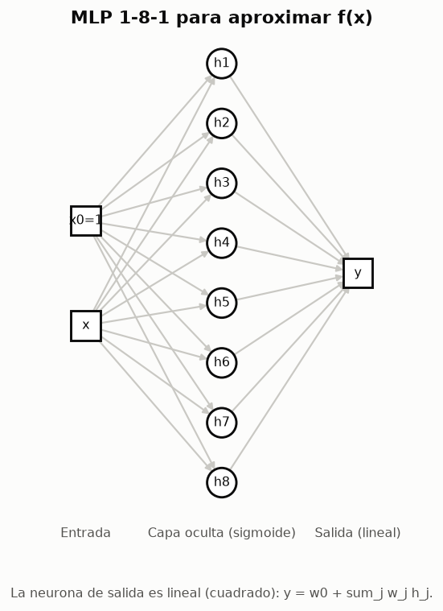
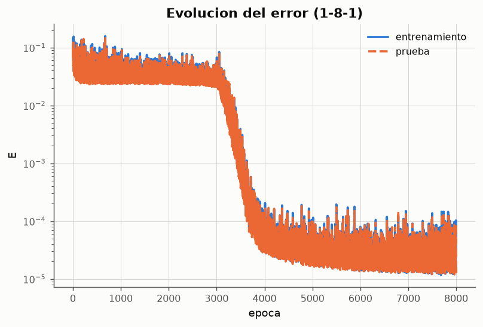
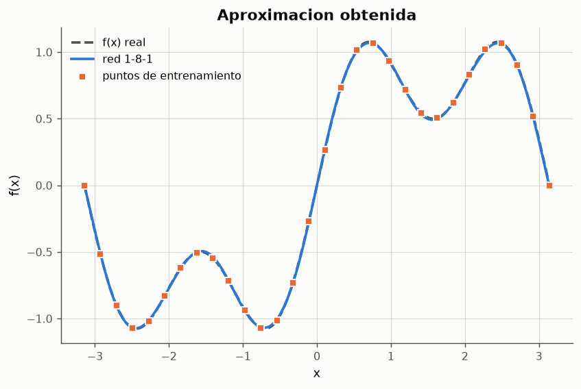
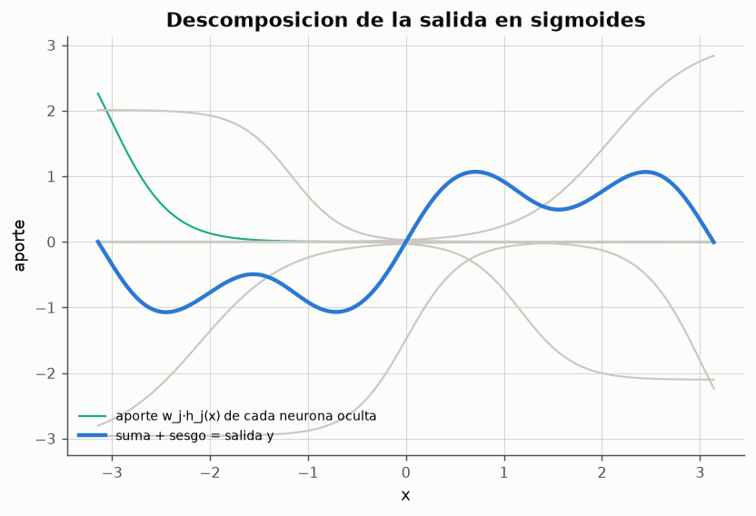
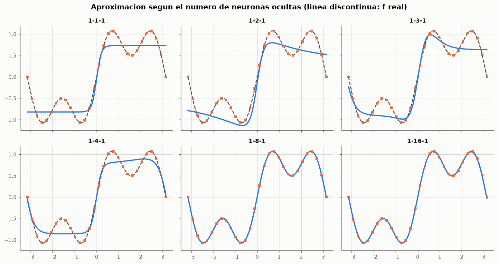
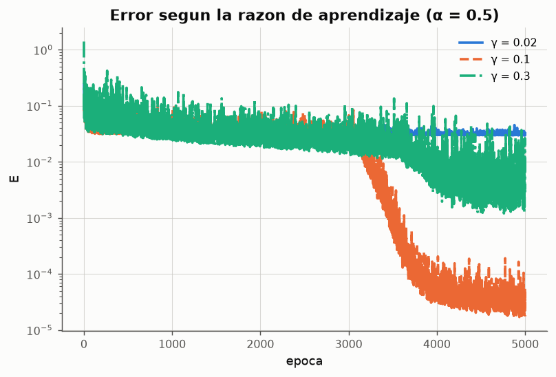
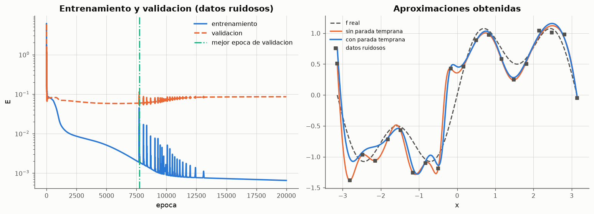

# Experimento 09 --- Perceptron multicapa: aproximacion de una funcion

> Informe generado automaticamente por los scripts de `experimentos/` el 2026-09-28 11:41.
> No editar a mano: se regenera con `python experimentos/ejecutar_todo.py`.

Un perceptron multicapa con una capa oculta de neuronas sigmoidales y una salida lineal es un **aproximador universal**: con suficientes neuronas ocultas puede aproximar cualquier funcion continua en un intervalo cerrado con el error que se desee (Cybenko, 1989; Hornik, Stinchcombe y White, 1989). El experimento entrena una red 1-H-1 con backpropagation para aproximar una funcion no lineal y no monotona, mide el error sobre puntos que la red **no vio** y estudia la influencia del numero de neuronas ocultas, la razon de aprendizaje, el momento y el criterio de parada.

## 1. Funcion objetivo y conjuntos de datos

$$
f(x) = \sin x + \tfrac{1}{2}\sin 3x, \qquad x \in [-\pi, \pi]
$$

- La funcion tiene cuatro extremos en el intervalo y mezcla dos frecuencias: una sola sigmoide (monotona) no puede reproducirla, y el numero de neuronas ocultas necesario es una pregunta abierta que el experimento responde empiricamente.
- **Entrenamiento**: 30 puntos equiespaciados en [−π, π].
- **Prueba**: 200 puntos aleatorios del mismo intervalo, distintos de los de entrenamiento. Miden la **generalizacion**: lo que hace la red entre los puntos vistos.
- La entrada x se usa sin normalizar: en [−π, π] ya es de orden unidad, y la frecuencia 3x requiere pendientes de las sigmoides del orden de 3, alcanzables con pesos iniciales en [−2, 2].

**Conjunto de entrenamiento**

| x | f(x) |
|---|---|
| -3.1416 | -0 |
| -2.9249 | -0.5176 |
| -2.7083 | -0.9017 |
| -2.4916 | -1.0697 |
| -2.2749 | -1.0199 |
| -2.0583 | -0.8295 |
| -1.8416 | -0.6197 |
| -1.625 | -0.5051 |
| -1.4083 | -0.5451 |
| -1.1916 | -0.719 |
| -0.975 | -0.9352 |
| -0.7583 | -1.0688 |
| -0.5417 | -1.0148 |
| -0.325 | -0.7331 |
| -0.1083 | -0.2678 |
| 0.1083 | 0.2678 |
| 0.325 | 0.7331 |
| 0.5417 | 1.0148 |
| 0.7583 | 1.0688 |
| 0.975 | 0.9352 |
| 1.1916 | 0.719 |
| 1.4083 | 0.5451 |
| 1.625 | 0.5051 |
| 1.8416 | 0.6197 |
| 2.0583 | 0.8295 |
| 2.2749 | 1.0199 |
| 2.4916 | 1.0697 |
| 2.7083 | 0.9017 |
| 2.9249 | 0.5176 |
| 3.1416 | 0 |

*Datos completos: [`09_entrenamiento.csv`](../tablas/09_entrenamiento.csv)*

## 2. Red 1-8-1: entrenamiento y aproximacion

- Arquitectura 1-8-1: 8 neuronas ocultas sigmoidales, salida lineal (φ(v) = v), 25 pesos en total.
- Salida lineal: en la retropropagacion su derivada es 1, de modo que δ de salida es directamente el error d − y, como en el ADALINE.
- γ = 0.1, momento α = 0.5, modo estocastico con orden barajado.
- Parada: E ≤ 1e-05 o 8000 epocas.



*Figura: Arquitectura de la red.*

```text
MLP 1-8-1 | gamma = 0.1, alpha = 0.5, modo estocastico | 25 pesos
epocas usadas: 8000 | parada: max_epocas | E final = 1.808e-05
```

**Error de entrenamiento y de prueba**

| conjunto | E (1/2 ECM) | RMSE | error_max | R2 |
|---|---|---|---|---|
| entrenamiento | 1.80791e-05 | 0.00601316 | 0.0114796 | 0.99994 |
| prueba | 2.05171e-05 | 0.00640579 | 0.0120557 | 0.999936 |

*Datos completos: [`09_metricas.csv`](../tablas/09_metricas.csv)*



*Figura: Error de entrenamiento y de prueba por epoca. Las dos curvas van juntas: la red no memoriza los puntos, aprende la funcion.*

La curva desciende a saltos: tramos casi planos (mesetas) separados por caidas. Cada caida corresponde a que una neurona oculta mas "encuentra" una parte de la funcion que aun no estaba explicada (una subida o bajada de sin 3x). Los errores de entrenamiento y de prueba son practicamente iguales durante todo el entrenamiento: con datos sin ruido y 30 puntos bien repartidos, ajustar los puntos equivale a ajustar la funcion.



*Figura: La salida de la red (continua) y la funcion real son indistinguibles a simple vista.*

## 3. Como construye la red la funcion



*Figura: Cada neurona oculta aporta un 'escalon suave' (una sigmoide desplazada, escalada y con su propia pendiente); la salida es su suma ponderada.*

**Parametros de cada neurona oculta (ordenadas por su centro)**

| neurona | sesgo w_j0 | peso w_j1 | centro x = -w_j0/w_j1 | pendiente |w_j1| | peso de salida |
|---|---|---|---|---|---|
| h1 | -9.87896 | -3.27312 | -3.0182 | 3.27312 | 3.77343 |
| h8 | -4.71058 | -2.24079 | -2.10219 | 2.24079 | -3.07608 |
| h7 | -4.35473 | -3.73169 | -1.16696 | 3.73169 | 2.01233 |
| h2 | 0.0115901 | -3.57095 | 0.00324567 | 3.57095 | -2.96048 |
| h3 | -4.23999 | 3.61754 | 1.17206 | 3.61754 | -2.10312 |
| h5 | -4.69255 | 2.25469 | 2.08124 | 2.25469 | 3.09879 |
| h4 | -9.88524 | 3.27493 | 3.01846 | 3.27493 | -3.73081 |
| h6 | -2.61479 | 0.0527571 | 49.5628 | 0.0527571 | 0.052842 |

*Datos completos: [`09_neuronas_ocultas.csv`](../tablas/09_neuronas_ocultas.csv)*

Cada neurona oculta es una sigmoide φ(w_j1·x + w_j0) centrada en x = −w_j0/w_j1 con pendiente proporcional a |w_j1|. La neurona de salida suma esos escalones suaves con pesos de ambos signos: un escalon hacia arriba seguido de uno hacia abajo forma una 'joroba', y con suficientes jorobas se construye cualquier curva continua. Es la intuicion del teorema de aproximacion universal, y explica por que los centros aprendidos se reparten por el intervalo donde la funcion cambia de pendiente.

## 4. Comparacion de configuraciones

Todas las corridas de esta seccion usan 5000 epocas como maximo.

### 4.1 Numero de neuronas ocultas

**Error segun el numero de neuronas ocultas (mediana de 3 semillas)**

| ocultas | pesos | E_entrenamiento_mediana | E_prueba_mediana | E_prueba_mejor | R2_prueba_mediana |
|---|---|---|---|---|---|
| 1 | 4 | 0.0401123 | 0.0281553 | 0.0275904 | 0.912543 |
| 2 | 7 | 0.0455195 | 0.0362552 | 0.027584 | 0.887383 |
| 3 | 10 | 0.0261838 | 0.0225341 | 0.0221064 | 0.930004 |
| 4 | 13 | 0.0305461 | 0.0270337 | 0.0175377 | 0.916027 |
| 8 | 25 | 0.000838481 | 0.000805158 | 1.73591e-05 | 0.997499 |
| 16 | 49 | 0.000160714 | 0.000144488 | 6.2643e-05 | 0.999551 |

*Datos completos: [`09_ocultas.csv`](../tablas/09_ocultas.csv)*



*Figura: Con 1-4 neuronas la red solo captura la tendencia y parte de los extremos; con 8 y 16 reproduce el armonico sin 3x.*

Con una neurona oculta la red solo puede producir **una** sigmoide: una curva monotona que sigue la tendencia general (el salto de −1 a +1 en torno a x = 0). Con 2-4 neuronas la red anade algunos extremos pero, en las epocas disponibles, no reproduce las cuatro oscilaciones: el error de prueba apenas mejora respecto de una sola neurona. El salto cualitativo ocurre con **8** neuronas (el error cae dos ordenes de magnitud), y 16 mejora un poco mas en la mediana. En teoria cuatro jorobas podrian construirse con unas 8 sigmoides (dos por joroba), lo que coincide con lo observado. Con redes pequenas ademas es mas facil quedar atrapado en un minimo local: la variabilidad entre semillas (ver `09_ocultas_corridas.csv`) es la misma manifestacion vista en el XOR.

### 4.2 Razon de aprendizaje y momento

**Razon de aprendizaje y momento (1-8-1)**

| gamma | alpha | paso_efectivo γ/(1-α) | E_final | E_prueba_final | epoca_E<1e-3 | parada |
|---|---|---|---|---|---|---|
| 0.02 | 0.5 | 0.04 | 0.0324508 | 0.0273052 | nan | max_epocas |
| 0.1 | 0.5 | 0.2 | 1.75965e-05 | 1.73591e-05 | 3437 | max_epocas |
| 0.3 | 0.5 | 0.6 | 0.00374301 | 0.00386896 | nan | max_epocas |
| 0.1 | 0 | 0.1 | 0.0163786 | 0.0148309 | nan | max_epocas |
| 0.1 | 0.9 | 1 | 0.0297245 | 0.0306768 | nan | max_epocas |

*Datos completos: [`09_gamma_momento.csv`](../tablas/09_gamma_momento.csv)*



*Figura: Pasos pequenos alargan las mesetas; pasos grandes producen oscilaciones.*

El descenso por el gradiente sustituye la minimizacion exacta de E por pasos Δw = −γ ∂E/∂w. Si γ es pequeno cada paso es fiable pero la red tarda en salir de las mesetas; si es grande avanza deprisa pero el paso puede saltar por encima del valle y el error oscila (en modo estocastico, cada patron empuja los pesos en una direccion distinta). El momento suaviza esas oscilaciones y acelera en las mesetas: con α = 0.9 el paso efectivo se multiplica por 10, lo que ayuda o perjudica segun que γ lo acompane. La combinacion elegida (γ = 0.1, α = 0.5, paso efectivo 0.2) es el mejor compromiso observado.

## 5. Criterio de parada con datos ruidosos

Con datos reales las salidas deseadas traen ruido. Se entrena una red grande (1-16-1, 49 pesos) sobre solo 20 puntos con ruido gaussiano de desviacion 0.25, en modo por lotes (γ = 0.5, α = 0.9) para que las curvas sean suaves. Se reserva un **conjunto de validacion** (otros 19 puntos ruidosos, intercalados) para decidir cuando parar, y el conjunto de prueba sin ruido mide la calidad real frente a f.

**Parada por numero de epocas frente a parada temprana**

| criterio | epocas | E_entrenamiento | E_validacion | E_prueba (f real) |
|---|---|---|---|---|
| sin parada temprana | 20000 | 0.000649074 | 0.0856101 | 0.0325393 |
| con parada temprana (paciencia 3000) | 10743 | 0.00754881 | 0.0524975 | 0.0225976 |

*Datos completos: [`09_parada_temprana.csv`](../tablas/09_parada_temprana.csv)*



*Figura: El error de entrenamiento sigue bajando mientras el de validacion se estanca o sube: la red empieza a ajustar el ruido.*

Sin parada temprana la red sigue reduciendo el error de entrenamiento a costa de curvarse para pasar cerca de los puntos ruidosos (**sobreajuste**). La parada temprana detiene el entrenamiento cuando el error de validacion lleva 3000 epocas sin mejorar y restaura los mejores pesos. En esta corrida la parada temprana obtuvo menor error frente a la funcion real, con menos epocas. El minimo del error de entrenamiento no es el objetivo: el objetivo es el error sobre datos nuevos, y solo puede estimarse con datos que no se usaron para ajustar los pesos.

## 6. Limitacion: la red no extrapola

![Fuera de [−π, π] todas las sigmoides se saturan y la salida tiende a una constante.](../figuras/09_extrapolacion.png)

*Figura: Fuera de [−π, π] todas las sigmoides se saturan y la salida tiende a una constante.*

La red aproxima f solo **donde tuvo datos**. Fuera del intervalo cada sigmoide esta saturada en 0 o en 1 y la salida se vuelve constante: la red no ha aprendido que f es periodica, solo su forma en [−π, π]. Es una limitacion general del aprendizaje a partir de ejemplos: la red interpola, no extrapola.

## 7. Conclusiones

- Una red 1-8-1 con sigmoides ocultas y salida lineal aproxima f(x) = sin x + 0.5 sin 3x con R² = 0.99994 sobre 200 puntos de prueba no vistos.
- La salida se construye como suma de sigmoides desplazadas y escaladas: es la idea del teorema de aproximacion universal.
- El numero de neuronas ocultas fija la complejidad alcanzable: con 1-4 neuronas solo se captura la tendencia; hacen falta unas 8 para reproducir el armonico sin 3x.
- γ y α controlan la velocidad y estabilidad del descenso por el gradiente; la curva de error muestra mesetas que dependen de ambos.
- Con datos ruidosos, el criterio de parada debe apoyarse en un conjunto de validacion: seguir bajando el error de entrenamiento lleva al sobreajuste.
- La red interpola dentro del dominio de entrenamiento pero no extrapola fuera de el.
