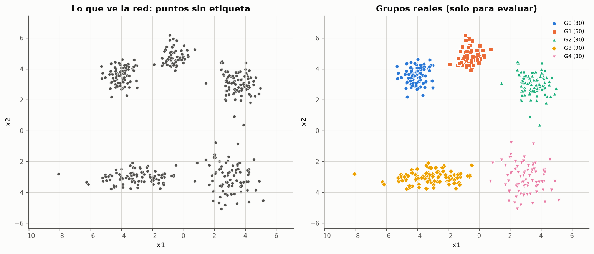
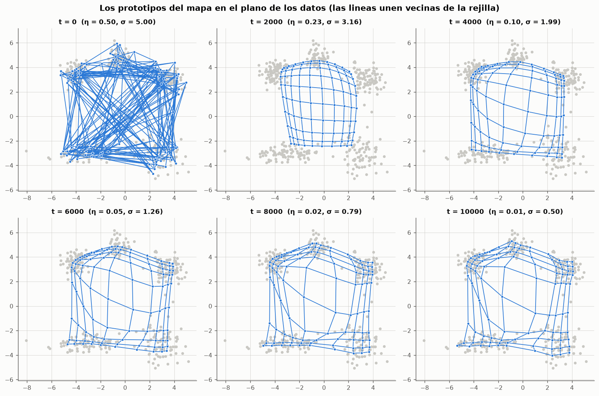
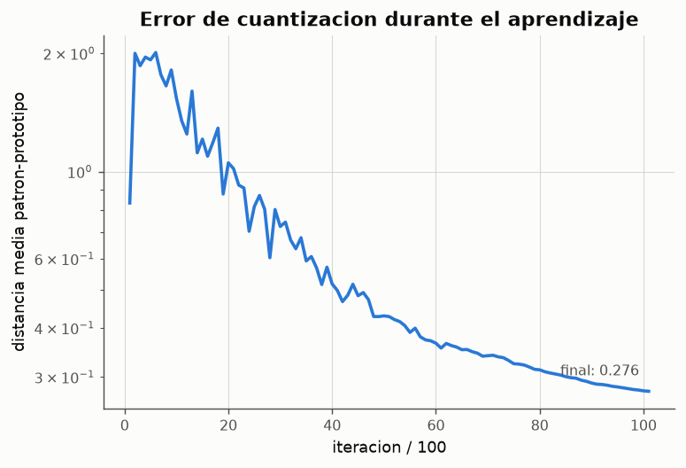
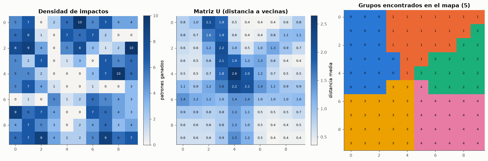
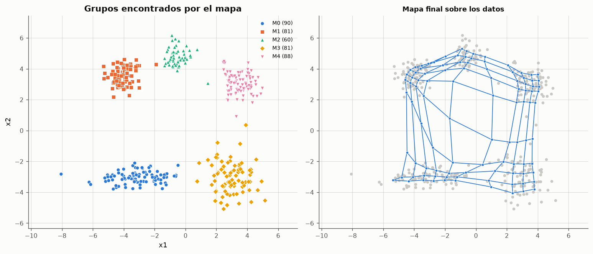
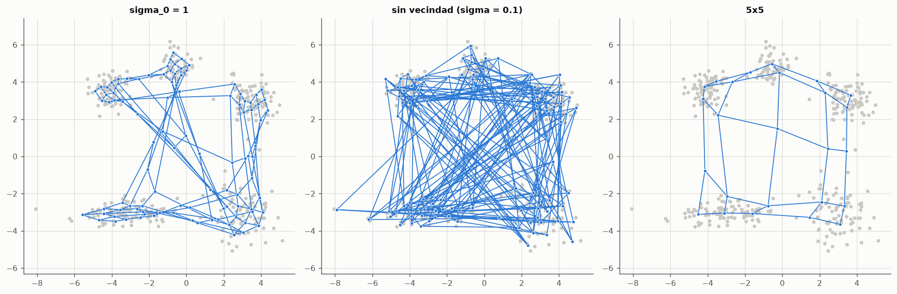

# Experimento 10 --- Mapas autoorganizados de Kohonen: grupos en el plano

> Informe generado automaticamente por los scripts de `experimentos/` el 2026-09-28 11:41.
> No editar a mano: se regenera con `python experimentos/ejecutar_todo.py`.

Todos los modelos anteriores aprendian de forma **supervisada**: cada patron venia con su salida deseada y el aprendizaje reducia el error. Un mapa autoorganizado de Kohonen aprende sin salida deseada: solo recibe los patrones y, mediante **aprendizaje competitivo** con vecindad, dispone sus neuronas de forma que reproducen la distribucion de los datos preservando su topologia. El experimento aplica un mapa de 10x10 neuronas a una nube de puntos del plano con cinco grupos y comprueba si el mapa revela esos grupos sin conocerlos.

## 1. Conjunto de datos

400 puntos del plano generados como cinco nubes gaussianas (semilla fija). Los grupos se eligieron distintos a proposito para que el problema no sea trivial: tamanos de 60 a 90 puntos, un grupo alargado (G3), uno mas disperso (G4) y dos grupos relativamente proximos entre si (G0 y G1).

**Parametros de generacion de los grupos**

| grupo | centro_x1 | centro_x2 | desv_x1 | desv_x2 | puntos |
|---|---|---|---|---|---|
| G0 | -4 | 3.5 | 0.55 | 0.55 | 80 |
| G1 | -0.5 | 4.8 | 0.45 | 0.45 | 60 |
| G2 | 3.5 | 3 | 0.7 | 0.7 | 90 |
| G3 | -3 | -3 | 1.3 | 0.4 | 90 |
| G4 | 3 | -3 | 0.9 | 0.9 | 80 |

*Datos completos: [`10_grupos.csv`](../tablas/10_grupos.csv)*

La etiqueta del grupo real se guarda **solo** para evaluar el resultado al final; el mapa nunca la recibe. Lo unico que ve la red son las coordenadas (x1, x2).



*Figura: Izquierda: los datos tal como los recibe el mapa. Derecha: los grupos con que se generaron.*

## 2. Modelo y parametros

Mapa rectangular de 10x10 = 100 neuronas. Cada neurona j tiene un vector de pesos w_j de dimension 2 --- un punto del mismo plano que los datos, su *prototipo* --- y una posicion fija r_j en la rejilla. En cada iteracion se elige un patron x al azar y:

$$
c = \arg\min_j \lVert x - w_j \rVert \qquad \text{(competicion: neurona ganadora)}
$$

$$
h_{cj}(t) = \exp\!\left(-\frac{\lVert r_c - r_j\rVert^2}{2\sigma(t)^2}\right) \qquad \text{(cooperacion: vecindad en la rejilla)}
$$

$$
w_j \leftarrow w_j + \eta(t)\,h_{cj}(t)\,\bigl(x - w_j\bigr) \qquad \text{(adaptacion)}
$$

$$
\eta(t) = \eta_0\left(\frac{\eta_f}{\eta_0}\right)^{t/T}, \qquad \sigma(t) = \sigma_0\left(\frac{\sigma_f}{\sigma_0}\right)^{t/T}
$$

**Parametros del mapa**

| parametro | valor | justificacion |
|---|---|---|
| tamano del mapa | 10x10 | ~4 veces menos neuronas que patrones: resolucion suficiente para ver fronteras (crestas) entre grupos sin que cada neurona represente 1-2 puntos |
| iteraciones T | 10000 | ~23 presentaciones por patron; el error de cuantizacion ya no mejora (seccion 6) |
| eta_0 -> eta_f | 0.5 -> 0.01 | paso grande para ordenar al principio, pequeno para afinar al final |
| sigma_0 -> sigma_f | 5 -> 0.5 | sigma_0 = medio mapa: al principio todo el mapa se mueve junto y se despliega sin pliegues; sigma_f < 1: al final solo la ganadora se mueve |
| inicializacion | patrones al azar | los prototipos empiezan dentro de la distribucion, sin ningun orden |

*Datos completos: [`10_parametros.csv`](../tablas/10_parametros.csv)*

```text
SOM 10x10 (100 neuronas) | eta 0.5 -> 0.01, sigma 5 -> 0.5, 10000 iteraciones
error de cuantizacion = 0.2760 | error topografico = 0.000
```

## 3. Autoorganizacion durante el aprendizaje



*Figura: De una malla enredada a una malla ordenada que cubre los cinco grupos.*

En t = 0 los prototipos son puntos de datos al azar y la malla esta completamente enredada: neuronas vecinas en la rejilla estan lejos en el plano. Durante la **fase de ordenamiento** (σ grande) cada ganadora arrastra a medio mapa consigo y la malla se desenreda y se extiende sobre los datos. Durante la **fase de convergencia** (σ < 1) cada neurona solo se mueve cuando gana, y los prototipos se concentran donde hay datos. Las neuronas que quedan entre grupos se estiran a lo largo de los 'puentes' vacios: son las que marcan las fronteras.



*Figura: El error de cuantizacion no es la funcion que se minimiza (no hay salida deseada), pero sirve para seguir el aprendizaje.*

## 4. Lectura del mapa: impactos, matriz U y grupos



*Figura: Las celdas con cero impactos y U alta forman crestas que separan valles: cada valle es un grupo.*

**Densidad de impactos**: las neuronas que no ganan ningun patron (celdas a 0) no representan datos; estan en el espacio vacio entre grupos. **Matriz U**: para cada neurona, la distancia media entre su prototipo y los de sus cuatro vecinas de la rejilla. Dentro de un grupo los prototipos estan apretados (U baja, valles); entre grupos, dos neuronas vecinas representan zonas alejadas del plano (U alta, crestas). Las crestas de la matriz U coinciden con las celdas sin impactos: las dos lecturas se confirman mutuamente.

**Segmentacion no supervisada**: las neuronas con U por debajo de la mediana (percentil 50) se consideran interiores; cada region conexa de neuronas interiores es un grupo, y las neuronas de las crestas se asignan al grupo interior con prototipo mas cercano. Cada patron hereda el grupo de su neurona ganadora. Ningun paso usa las clases reales. Resultado: **5 grupos**.



*Figura: Izquierda: particion obtenida sin supervision. Derecha: el mapa entrenado.*

## 5. Correspondencia entre grupos del mapa y grupos reales

**Tabla de contingencia: filas = grupo real, columnas = grupo del mapa**

| grupo real | M0 | M1 | M2 | M3 | M4 |
|---|---|---|---|---|---|
| G0 | 0 | 80 | 0 | 0 | 0 |
| G1 | 0 | 1 | 59 | 0 | 0 |
| G2 | 0 | 0 | 1 | 1 | 88 |
| G3 | 90 | 0 | 0 | 0 | 0 |
| G4 | 0 | 0 | 0 | 80 | 0 |

*Datos completos: [`10_contingencia.csv`](../tablas/10_contingencia.csv)*

**Cuanto mapa dedica la red a cada grupo**

| grupo real | neuronas que gana | fraccion del mapa % | puntos |
|---|---|---|---|
| G0 | 16 | 16 | 80 |
| G1 | 11 | 11 | 60 |
| G2 | 21 | 21 | 90 |
| G3 | 17 | 17 | 90 |
| G4 | 17 | 17 | 80 |

*Datos completos: [`10_neuronas_por_grupo.csv`](../tablas/10_neuronas_por_grupo.csv)*

La **pureza** (fraccion de puntos cuyo grupo del mapa tiene como mayoria su grupo real) es **0.993**. Cada grupo real ocupa una region contigua del mapa: la red preserva la topologia, de modo que puntos proximos en el plano caen en neuronas proximas de la rejilla (error topografico = 0.000). El numero de neuronas dedicadas a cada grupo crece con su numero de puntos y con su extension: el mapa asigna resolucion segun la densidad de los datos (**magnificacion**).

## 6. Comparacion de configuraciones

Cada configuracion se entrena con 5 semillas; se promedian los errores y la pureza.

**Efecto del tamano, la vecindad y la duracion**

| configuracion | error_cuantizacion | error_topografico | grupos (5 semillas) | pureza_media |
|---|---|---|---|---|
| 10x10, base | 0.278212 | 0.014 | 5 5 5 5 5 | 0.997 |
| 5x5 | 0.537075 | 0.0005 | 3 3 3 3 3 | 0.645 |
| 15x15 | 0.197146 | 0.007 | 5 5 5 5 5 | 0.9995 |
| 10x10, sigma_0 = 1 (vecindad pequena) | 0.258792 | 0.0625 | 4 4 5 4 5 | 0.9085 |
| 10x10, sin vecindad (sigma = 0.1) | 0.176226 | 0.9465 | 4 2 5 4 5 | 0.391 |
| 10x10, 1 000 iteraciones | 0.377118 | 0.016 | 5 5 5 5 5 | 0.9975 |
| 10x10, 30 000 iteraciones | 0.252238 | 0.0085 | 5 5 5 5 5 | 0.999 |

*Datos completos: [`10_configuraciones.csv`](../tablas/10_configuraciones.csv)*



*Figura: Sin una vecindad inicial amplia la malla queda enredada: los prototipos cubren los datos pero el orden topologico se pierde.*

* **Tamano del mapa**: un mapa de 5x5 (25 neuronas) cuantiza peor y, sobre todo, deja muy pocas neuronas para las fronteras: con solo 5 neuronas por lado no caben cinco valles separados por crestas y la segmentacion encuentra solo 3 grupos. Un mapa de 15x15 reduce el error de cuantizacion y separa igual de bien que el de 10x10, a costa de mas calculo y de mas neuronas 'vacias'.
* **Vecindad**: es lo que distingue a un mapa de Kohonen de un simple aprendizaje competitivo. Con σ_0 pequeno o sin vecindad la cuantizacion puede ser incluso mejor (cada neurona se dedica a su zona), pero el **error topografico se dispara**: vecinas de la rejilla ya no representan zonas vecinas del plano, la matriz U deja de tener valles y crestas limpios y la segmentacion falla. Sin orden topologico no hay mapa que leer.
* **Iteraciones**: con solo 1 000 iteraciones (~2 presentaciones por patron) el mapa ya se ordena y separa los grupos, porque estos estan bien definidos; lo que queda peor es la cuantizacion (prototipos menos ajustados). Pasar de 10 000 a 30 000 apenas mejora: el calendario de η y σ, no la duracion, es lo que determina la calidad del mapa.

## 7. Limite de resolucion: grupos que se tocan

Se acerca G1 a G0 a lo largo de la recta que une sus centros y se repite el analisis con 5 semillas por distancia.

**Deteccion de G0 y G1 segun su separacion**

| distancia G0-G1 | grupos (5 semillas) | separa G0 y G1 (%) | pureza_media |
|---|---|---|---|
| 3.73363 | 5 5 5 5 5 | 100 | 0.997 |
| 3.23363 | 5 5 5 5 5 | 100 | 0.996 |
| 2.73363 | 4 4 4 4 4 | 0 | 0.848 |
| 2.23363 | 4 4 4 4 4 | 0 | 0.8475 |
| 1.73363 | 4 4 4 4 4 | 0 | 0.848 |

*Datos completos: [`10_resolucion.csv`](../tablas/10_resolucion.csv)*

Mientras la separacion entre centros supera ~3.2 (unas 3 veces la suma de las desviaciones tipicas de ambos grupos, 0.55 + 0.45 = 1), queda una franja vacia entre ambos grupos, las neuronas que caen en ella tienen U alta y el mapa los separa. Cuando se acercan mas, las nubes se solapan, la densidad deja de tener un hueco y el mapa los representa como **un solo grupo** (la pureza cae a ~0.85, que es exactamente lo que se pierde al fundir 60 puntos de G1 con G0). No es un fallo del algoritmo sino una propiedad del aprendizaje no supervisado: sin etiquetas, un 'grupo' solo puede definirse como una region densa rodeada de regiones menos densas, y dos nubes solapadas sin hueco entre ellas son, para los datos, una sola.

## 8. Conclusiones

- El mapa de 10x10 identifica los 5 grupos sin recibir ninguna etiqueta, con pureza 0.993 respecto de los grupos reales.
- El aprendizaje es competitivo y cooperativo: no se minimiza un error respecto de una salida deseada, sino que cada neurona se desplaza hacia los patrones que gana y arrastra a sus vecinas de la rejilla.
- La vecindad es la que produce la preservacion de la topologia; sin ella se obtiene una cuantizacion sin orden, en la que la matriz U no revela grupos.
- La matriz U y la densidad de impactos son las herramientas de lectura: los grupos son valles, las fronteras son crestas de neuronas sin patrones.
- El mapa distingue grupos mientras exista una zona de baja densidad entre ellos; grupos solapados se funden, lo cual es una limitacion inherente al agrupamiento no supervisado.
- Contraste con el aprendizaje supervisado (actividades 1-3): alli la red aprende una correspondencia entrada → salida dada; aqui aprende la **estructura** de las entradas, y la interpretacion de los grupos la pone el analista despues.
