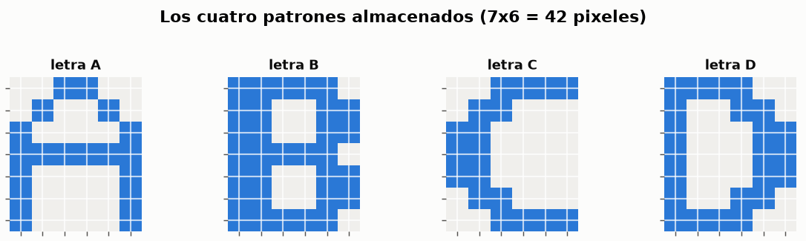
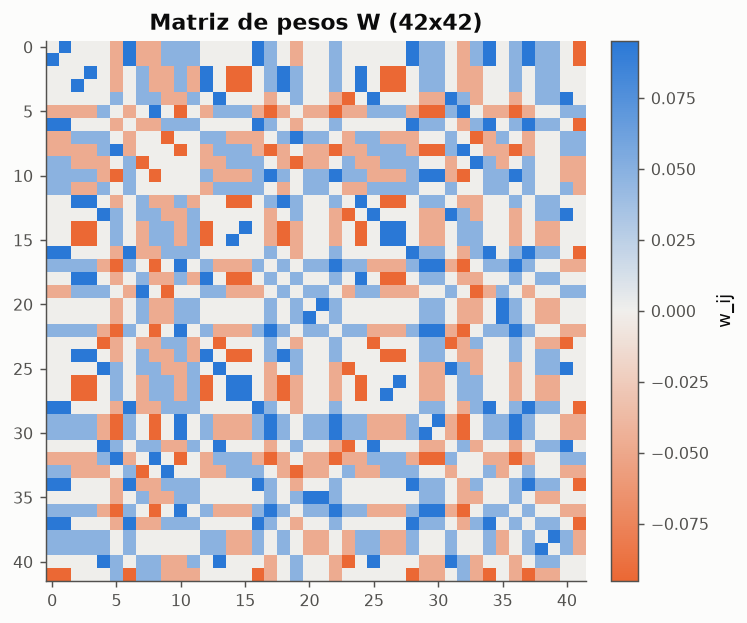
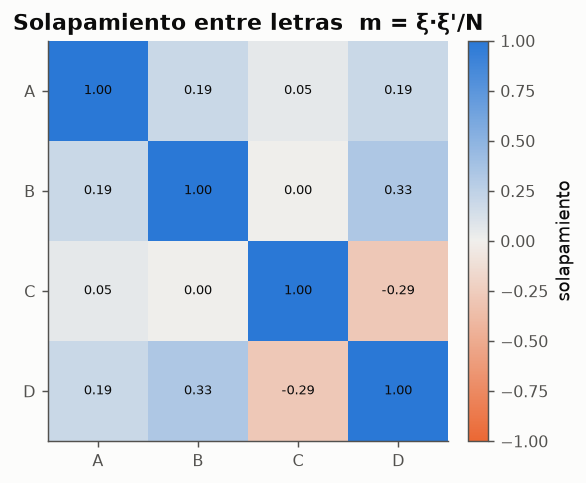
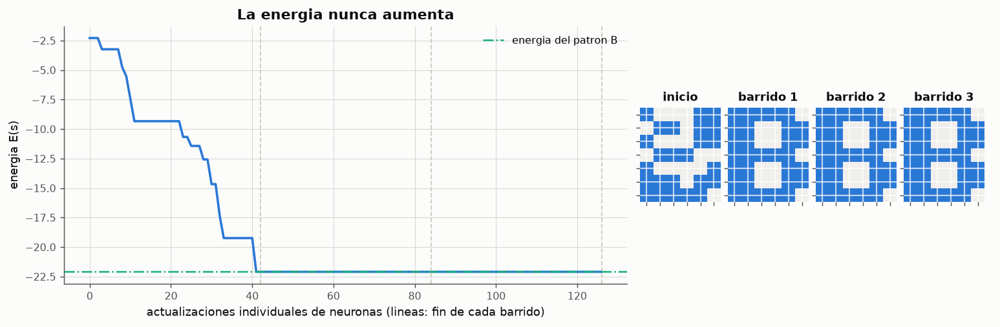
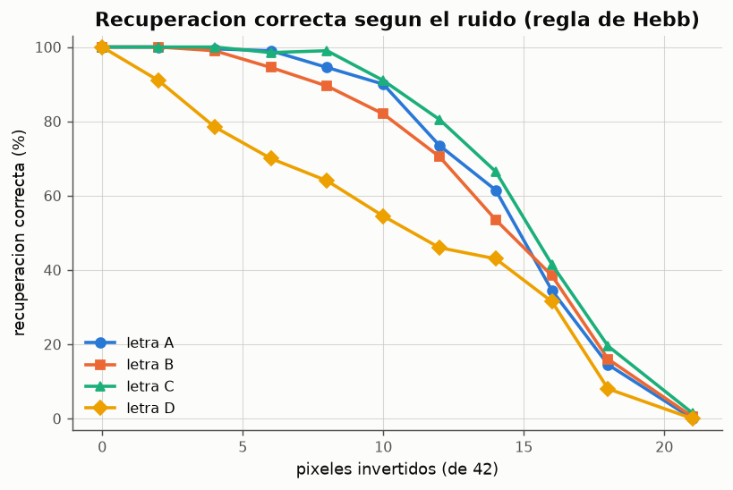
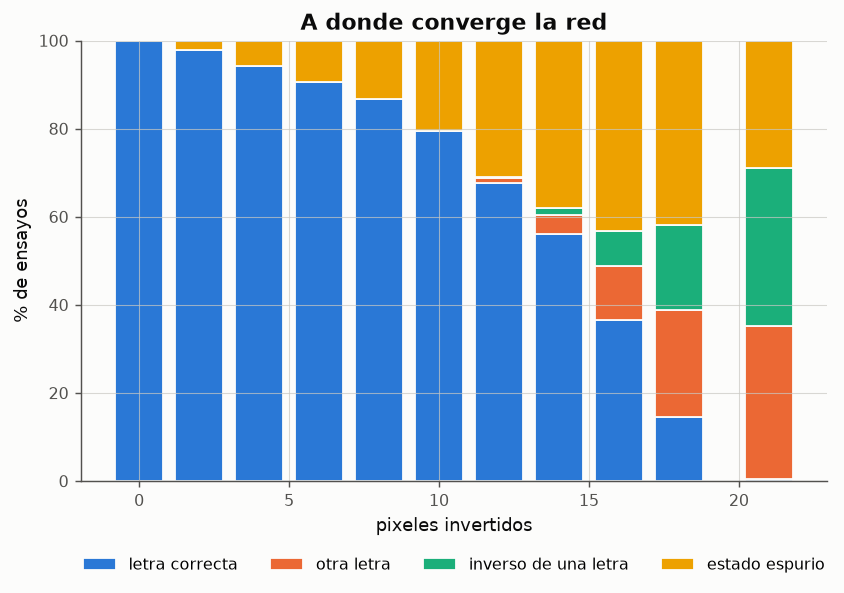
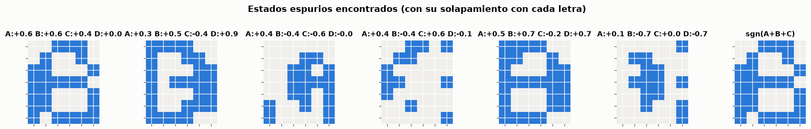
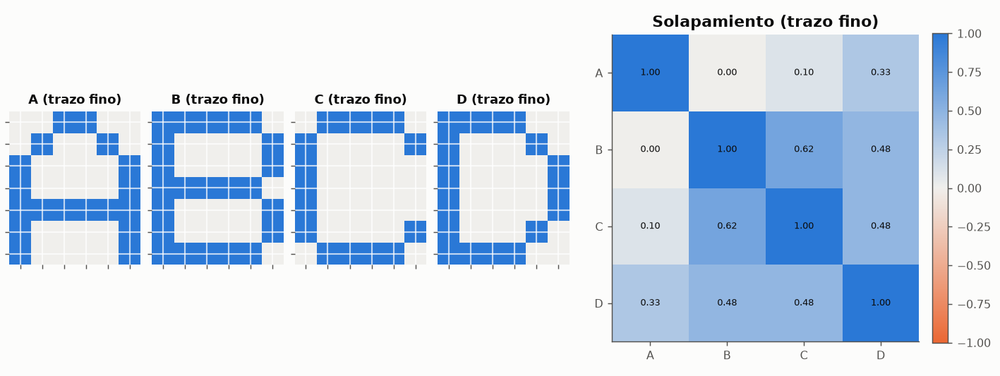

# Experimento 11 --- Red de Hopfield: reconocimiento de las letras A, B, C y D

> Informe generado automaticamente por los scripts de `experimentos/` el 2026-09-28 11:42.
> No editar a mano: se regenera con `python experimentos/ejecutar_todo.py`.

Una red de Hopfield es una **memoria asociativa**: almacena un conjunto de patrones y, a partir de una version incompleta o contaminada de uno de ellos, evoluciona hasta recuperarlo. No hay salida deseada ni error que minimizar durante el uso: la red recorre su funcion de energia cuesta abajo hasta un minimo, y los patrones almacenados son esos minimos. El experimento disena una red de 42 neuronas para cuatro letras de 7x6 pixeles, mide su tasa de reconocimiento frente al ruido y analiza cuando y por que falla.

## 1. Representacion de las imagenes

*Figura: Imagenes originales.*

Cada imagen es una matriz de 7 filas por 6 columnas. Se lee fila a fila y se convierte en un vector de 42 elementos con codificacion **bipolar**: pixel negro = +1, blanco = −1. La codificacion bipolar (y no binaria 0/1) es la natural en Hopfield: con 0/1 la regla de Hebb no refuerza las coincidencias de pixeles blancos, y el umbral de cada neurona tendria que compensar la actividad media.

**Patrones como vectores de 42 elementos**

| letra | vector (fila a fila, # = +1, . = -1) | pixeles negros |
|---|---|---|
| A | ..##.. .#..#. #....# ###### #....# #....# #....# | 18 |
| B | #####. ##..## ##..## #####. ##..## ##..## #####. | 31 |
| C | ..#### .##... ##.... ##.... ##.... .##... ..#### | 18 |
| D | ####.. #..##. #...## #...## #...## #..##. ####.. | 23 |

*Datos completos: [`11_patrones.csv`](../tablas/11_patrones.csv)*

## 2. Diseno de la red y almacenamiento

- **42 neuronas**, una por pixel; el estado de la red *es* la imagen.
- Conexion **total y recurrente**: cada neurona recibe la salida de las otras 41. Pesos simetricos w_ij = w_ji y sin autoconexiones w_ii = 0 → 42·41/2 = 861 pesos distintos.
- Neuronas bipolares con funcion signo y umbral 0.
- Almacenamiento con la **regla de Hebb** en una sola pasada (no hay iteraciones de entrenamiento):

$$
w_{ij} = \frac{1}{N}\sum_{\mu=1}^{P} \xi_i^{\mu}\,\xi_j^{\mu}\quad (i \neq j), \qquad w_{ii} = 0, \qquad N = 42,\; P = 4
$$

Recuperacion con **dinamica asincrona**: en cada barrido se visitan las 42 neuronas en orden aleatorio y cada una se actualiza con el estado mas reciente,

$$
s_i \leftarrow \operatorname{sgn}\Bigl(\sum_{j} w_{ij}\, s_j\Bigr)
$$

hasta que un barrido completo no cambia ninguna neurona (punto fijo). Con pesos simetricos y actualizacion asincrona la energia

$$
E(\mathbf{s}) = -\tfrac{1}{2}\sum_{i,j} w_{ij}\, s_i\, s_j
$$

no aumenta nunca (cada cambio de una neurona la reduce estrictamente), y como el numero de estados es finito la red **siempre converge**. Los patrones almacenados deberian ser minimos locales de E: los *atractores* de la dinamica.

*Figura: Pesos simetricos con diagonal nula. Azul: pixeles que suelen coincidir; naranja: pixeles que suelen ser opuestos.*

**Los cuatro patrones son puntos fijos de la red**

| letra | es_punto_fijo | energia |
|---|---|---|
| A | True | -20.5714 |
| B | True | -22.0952 |
| C | True | -20.7619 |
| D | True | -23.8095 |

*Datos completos: [`11_puntos_fijos.csv`](../tablas/11_puntos_fijos.csv)*

*Figura: Solapamiento entre pares de letras: 1 en la diagonal; cuanto mas cerca de 0 fuera de ella, mejor.*

El solapamiento maximo entre dos letras distintas es 0.33 (entre B y D). Esta magnitud es la que decide si la regla de Hebb funciona: el campo local de la neurona i cuando la red esta en el patron ν es

$$
h_i = \sum_j w_{ij}\,\xi_j^{\nu} \approx \xi_i^{\nu} + \sum_{\mu \neq \nu} \xi_i^{\mu}\, m_{\mu\nu}
$$

El primer termino (senal) empuja hacia el patron correcto; el segundo (**diafonia** o *crosstalk*) es la interferencia de las demas memorias. Si la diafonia supera a la senal en algun pixel, el patron deja de ser un punto fijo. Las letras se disenaron con trazo grueso precisamente para mantener bajos los solapamientos (seccion 6).

## 3. Recuperacion de patrones contaminados

*Figura: Cada par muestra la imagen con ruido y el estado final de la red.*

**Resultados de los ejemplos**

| letra | pixeles_invertidos | distancia_inicial | resultado | barridos | neuronas_cambiadas | E_inicial | E_final |
|---|---|---|---|---|---|---|---|
| A | 4 | 4 | A | 2 | 4 | -13.9048 | -20.5714 |
| A | 8 | 8 | A | 2 | 8 | -6.28571 | -20.5714 |
| A | 12 | 12 | A | 2 | 12 | -2.28571 | -20.5714 |
| B | 4 | 4 | B | 2 | 4 | -12.381 | -22.0952 |
| B | 8 | 8 | B | 2 | 8 | -6.85714 | -22.0952 |
| B | 12 | 12 | B | 2 | 12 | -3.2381 | -22.0952 |
| C | 4 | 4 | C | 2 | 4 | -12.7619 | -20.7619 |
| C | 8 | 8 | C | 2 | 8 | -8 | -20.7619 |
| C | 12 | 12 | C | 3 | 12 | -4 | -20.7619 |
| D | 4 | 4 | D | 2 | 4 | -15.0476 | -23.8095 |
| D | 8 | 8 | D | 2 | 8 | -8 | -23.8095 |
| D | 12 | 12 | espurio | 3 | 13 | -5.14286 | -24.381 |

*Datos completos: [`11_ejemplos.csv`](../tablas/11_ejemplos.csv)*

*Figura: Letra B con 12 pixeles invertidos: la energia desciende en escalones hasta la letra B (E = -22.10).*

La energia es una funcion de Lyapunov de la dinamica: cada vez que una neurona cambia, E disminuye; cuando ninguna puede cambiar, la red esta en un minimo local. Recordar es **descender por la superficie de energia** desde el punto de partida (la imagen contaminada) hasta el fondo del valle en que cae. La mayor parte de la correccion ocurre en el primer barrido.

## 4. Tasa de reconocimiento frente al ruido

Para cada letra y cada nivel de ruido (k pixeles invertidos elegidos al azar) se generan 200 imagenes contaminadas distintas y se deja evolucionar la red. El resultado se clasifica en: recuperacion **correcta**, **otra letra** almacenada, el **inverso** de una letra, o un **estado espurio** (un minimo que no es ninguna letra).

**Promedio sobre las cuatro letras**

| pixeles_invertidos | ruido_% | correcto_% | otra_letra_% | inverso_% | espurio_% | barridos_medios |
|---|---|---|---|---|---|---|
| 0 | 0 | 100 | 0 | 0 | 0 | 1 |
| 2 | 4.7619 | 97.75 | 0 | 0 | 2.25 | 2.0025 |
| 4 | 9.52381 | 94.25 | 0 | 0 | 5.75 | 2.0025 |
| 6 | 14.2857 | 90.5 | 0 | 0 | 9.5 | 2.01625 |
| 8 | 19.0476 | 86.75 | 0 | 0 | 13.25 | 2.03125 |
| 10 | 23.8095 | 79.375 | 0 | 0 | 20.625 | 2.09875 |
| 12 | 28.5714 | 67.625 | 1.25 | 0.25 | 30.875 | 2.165 |
| 14 | 33.3333 | 56.125 | 4.25 | 1.5 | 38.125 | 2.30375 |
| 16 | 38.0952 | 36.5 | 12.375 | 7.875 | 43.25 | 2.4125 |
| 18 | 42.8571 | 14.5 | 24.375 | 19.25 | 41.875 | 2.4575 |
| 21 | 50 | 0.5 | 34.75 | 35.75 | 29 | 2.32375 |

*Datos completos: [`11_reconocimiento.csv`](../tablas/11_reconocimiento.csv)*

*Figura: Porcentaje de recuperaciones correctas por letra (200 ensayos por punto).*

**Recuperacion correcta (%) por letra**

| pixeles_invertidos | A | B | C | D |
|---|---|---|---|---|
| 0 | 100 | 100 | 100 | 100 |
| 2 | 100 | 100 | 100 | 91 |
| 4 | 99.5 | 99 | 100 | 78.5 |
| 6 | 99 | 94.5 | 98.5 | 70 |
| 8 | 94.5 | 89.5 | 99 | 64 |
| 10 | 90 | 82 | 91 | 54.5 |
| 12 | 73.5 | 70.5 | 80.5 | 46 |
| 14 | 61.5 | 53.5 | 66.5 | 43 |
| 16 | 34.5 | 38.5 | 41.5 | 31.5 |
| 18 | 14.5 | 16 | 19.5 | 8 |
| 21 | 0 | 0.5 | 1.5 | 0 |

*Datos completos: [`11_reconocimiento_tabla.csv`](../tablas/11_reconocimiento_tabla.csv)*

Maximo ruido con al menos 90 % de recuperacion correcta: **A**: 10 px (24 %), **B**: 6 px (14 %), **C**: 10 px (24 %), **D**: 2 px (5 %). Con 21 pixeles invertidos (50 %) la imagen es ruido puro --- no tiene mas parecido con la letra original que con su inversa --- y ninguna memoria puede recuperarla; es la referencia de 'azar'. Las letras con mayor solapamiento con alguna otra son las que antes empiezan a fallar, porque sus valles de energia son mas estrechos y estan mas cerca de los valles vecinos.

## 5. Reconocimientos incorrectos

*Figura: Desglose del estado final segun el nivel de ruido (promedio de las cuatro letras).*

Tipos de error observados:

- **Otra letra**: la imagen contaminada quedo mas cerca (en distancia de Hamming) de otra letra que de la original, y la red la recupera --- correctamente desde su punto de vista. Es mas frecuente entre las letras mas solapadas.
- **Inverso**: por la simetria de la regla de Hebb, E(−ξ) = E(ξ), de modo que el negativo de cada letra tambien es un atractor. Solo se alcanza con ruido muy alto, cuando la imagen esta mas cerca del negativo que de la letra.
- **Estados espurios**: minimos de energia que no corresponden a ninguna letra. Con 14 pixeles de ruido se encontraron 14 estados espurios distintos. Muchos son **mezclas** de varias letras, como sgn(ξ_A + ξ_B + ξ_C), cuya existencia predice la teoria.

*Figura: Estados finales que no son ninguna letra; el ultimo es la mezcla teorica de tres letras.*

¿Es sgn(ξ_A + ξ_B + ξ_C) un punto fijo de esta red? **True**. Energia de la mezcla: -16.76, frente a -21.81 de media para las letras. Los estados espurios encontrados tienen energias entre -24.38 y -10.29: algunos son valles **tan profundos o mas** que las propias letras (la energia de las letras va de -23.81 a -20.57). Lo que los hace poco frecuentes con ruido bajo no es su profundidad sino el tamano de su cuenca de atraccion: una imagen poco contaminada esta mucho mas cerca de su letra que de cualquier estado espurio.

## 6. El diseno de los patrones importa: letras de trazo fino

*Figura: El dibujo 'natural' de las letras con trazo de un pixel y sus solapamientos.*

**¿Siguen siendo puntos fijos las letras de trazo fino?**

| letra | punto_fijo_trazo_fino | pixeles_inestables | punto_fijo_trazo_grueso |
|---|---|---|---|
| A | True | 0 | True |
| B | False | 4 | True |
| C | False | 4 | True |
| D | False | 2 | True |

*Datos completos: [`11_trazo_fino.csv`](../tablas/11_trazo_fino.csv)*

**Recuperacion correcta (%) con las letras de trazo fino y regla de Hebb**

| pixeles_invertidos | A | B | C | D |
|---|---|---|---|---|
| 0 | 100 | 0 | 0 | 0 |
| 4 | 99 | 0 | 0 | 0 |
| 8 | 85 | 0 | 0 | 0 |
| 12 | 64 | 0 | 0 | 0 |

*Datos completos: [`11_trazo_fino_reconocimiento.csv`](../tablas/11_trazo_fino_reconocimiento.csv)*

El primer diseno probado fue el dibujo natural con trazo de un pixel. B, C y D comparten la columna izquierda, las filas superior e inferior y --- en bipolar, donde el blanco tambien cuenta --- casi todo el fondo: el solapamiento B-C llega a 0.62. Con esos solapamientos la diafonia supera a la senal en varios pixeles, y **B, C y D dejan de ser puntos fijos**: la red no puede recuperarlas ni siquiera sin ruido, porque al presentarle la letra exacta la dinamica la aleja de ella. Solo la A, la menos parecida a las demas, sobrevive.

Cuatro patrones en 42 neuronas estan por debajo de la capacidad teorica (0.138·42 ≈ 5.8), pero esa cota vale para patrones **aleatorios** (solapamientos del orden de 1/√N ≈ 0.15). Las letras reales estan muy correlacionadas. Rediseñarlas con trazo grueso y formas diferenciadas redujo el solapamiento maximo a 0.33 y basto para que la regla de Hebb funcione. La leccion: en una memoria de Hopfield con regla de Hebb, la **codificacion de los patrones** forma parte del diseno de la red.

## 7. Alternativa: regla de la pseudoinversa, y capacidad

$$
W = \Xi\,(\Xi^{T}\Xi)^{-1}\,\Xi^{T}, \qquad \Xi = [\xi^1 \cdots \xi^P] \in \mathbb{R}^{N\times P}
$$

La regla de la pseudoinversa (o de proyeccion) sustituye la suma de productos externos por el proyector ortogonal sobre el subespacio que generan los patrones. Tiene en cuenta sus correlaciones --- el factor (Ξ^T Ξ)^{-1} las 'descorrelaciona' --- y garantiza W ξ^μ = ξ^μ: todo patron linealmente independiente es punto fijo. El precio es que ya no es local ni de una sola pasada acumulativa: requiere invertir una matriz P x P con todos los patrones a la vez.

**Recuperacion correcta media (%) segun regla y diseno**

| red | 0 px | 4 px | 8 px | 12 px | 16 px |
|---|---|---|---|---|---|
| Hebb, trazo grueso | 100 | 94.25 | 85.75 | 66 | 38.5 |
| pseudoinversa, trazo grueso | 100 | 100 | 99.25 | 81.75 | 41.25 |
| Hebb, trazo fino | 25 | 24.75 | 21.25 | 16 | 8.25 |
| pseudoinversa, trazo fino | 100 | 99.75 | 95.25 | 79.75 | 42.75 |

*Datos completos: [`11_hebb_vs_pseudoinversa.csv`](../tablas/11_hebb_vs_pseudoinversa.csv)*

**Capacidad con patrones aleatorios de 42 elementos (20 repeticiones): % de patrones que son puntos fijos**

| patrones_P | P/N | hebb | pseudoinversa |
|---|---|---|---|
| 2 | 0.047619 | 100 | 100 |
| 4 | 0.0952381 | 100 | 100 |
| 6 | 0.142857 | 98.3333 | 100 |
| 8 | 0.190476 | 83.75 | 100 |
| 10 | 0.238095 | 60.5 | 100 |
| 12 | 0.285714 | 42.5 | 100 |
| 16 | 0.380952 | 8.75 | 100 |

*Datos completos: [`11_capacidad.csv`](../tablas/11_capacidad.csv)*

Con patrones aleatorios la regla de Hebb empieza a perder patrones en torno a P ≈ 0.1-0.14·N, en linea con la capacidad teorica 0.138·N ≈ 5.8. La pseudoinversa mantiene todos los patrones como puntos fijos hasta P < N, aunque con P grande sus cuencas de atraccion se estrechan y tolera menos ruido.

## 8. Conclusiones

- Una red de Hopfield de 42 neuronas almacena las cuatro letras de 7x6 con la regla de Hebb en una sola pasada, y las cuatro son atractores de la dinamica.
- La red recupera las letras contaminadas: con 8 pixeles invertidos (19 %) la tasa media de recuperacion correcta es 87 %. El reconocimiento se degrada gradualmente con el ruido y llega al azar al 50 %.
- La recuperacion es un descenso de energia; los errores corresponden a caer en otro valle: otra letra, el inverso de una letra o un estado espurio (mezclas).
- La capacidad real depende de la correlacion entre patrones, no solo de su numero: el dibujo natural de las letras (trazo fino) hace fallar a la regla de Hebb con solo 4 patrones. Reducir el solapamiento en el diseno, o usar la regla de la pseudoinversa, lo resuelve.
- Contraste con los modelos supervisados: la red no aprende una correspondencia entrada → salida, sino que convierte cada patron en un estado estable; la 'respuesta' es el estado final completo, una memoria direccionable por contenido.
