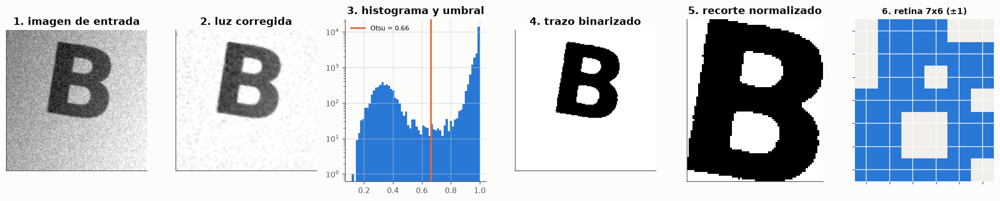
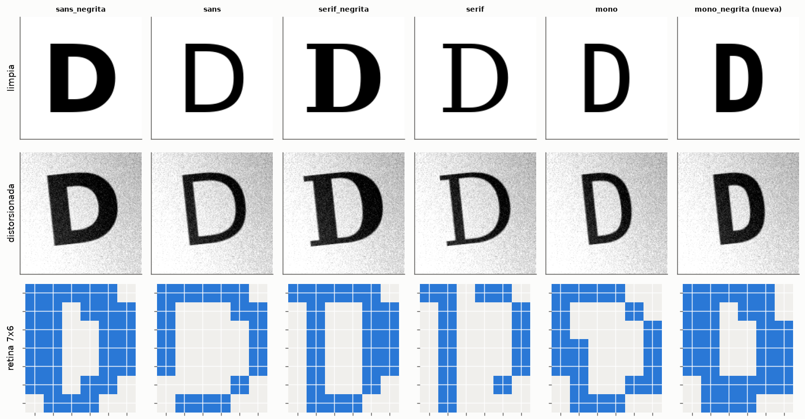
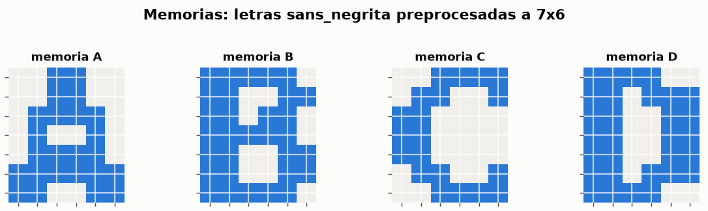
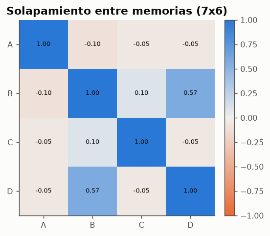
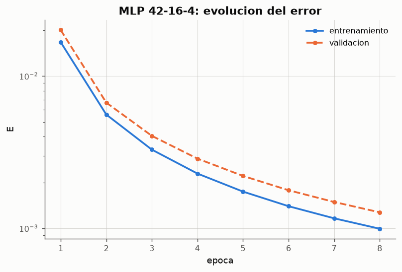
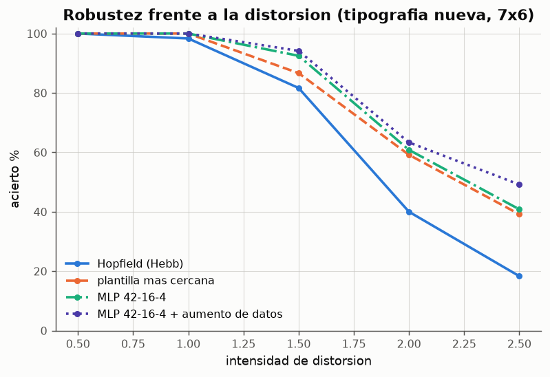

# Experimento 12 --- Imagenes reales: de la foto a la retina de 7x6

> Informe generado automaticamente por los scripts de `experimentos/` el 2026-09-28 16:07.
> No editar a mano: se regenera con `python experimentos/ejecutar_todo.py`.

Las redes de los experimentos anteriores reciben patrones ya codificados. En la practica los datos llegan como **imagenes**: fotos o escaneos de cualquier tamano, con fondo, iluminacion irregular y el objeto en cualquier posicion. Este experimento construye el preprocesamiento que lleva una imagen a la retina de 7x6 de la actividad 5, evalua la red de Hopfield sobre imagenes de letras con tipografias reales y distorsiones de camara, y la compara con un perceptron multicapa **entrenado** con cientos de imagenes. Ademas deja preparado el flujo para usar fotos propias.

## 1. De la imagen al patron: preprocesamiento

- **Escala de grises**: luminancia en [0, 1].
- **Umbral de Otsu**: separa trazo y fondo eligiendo el nivel de gris que maximiza la varianza entre las dos clases; se adapta solo a cada foto.
- **Polaridad**: el borde de la foto se toma como fondo; si es oscuro (tiza sobre pizarra), se invierte la imagen.
- **Limpieza e iluminacion**: filtro de mediana contra el ruido del sensor y division por una superficie cuadratica ajustada a los pixeles de fondo, que borra sombras y gradientes de luz.
- **Recorte y normalizacion**: se recorta el rectangulo que contiene el trazo y se estira hasta llenar la retina, de modo que posicion y tamano de la letra en la foto dejan de importar.
- **Reduccion por bloques**: cada pixel de la retina es la fraccion de trazo de su bloque; se enciende (+1) si supera 0.5 y queda en −1 en caso contrario.

*Figura: Una 'foto' de la letra B (rotada, desenfocada, con luz desigual y ruido) reducida a 42 pixeles bipolares.*

## 2. Imagenes de trabajo

*Figura: La letra D en las seis tipografias usadas: limpia, con distorsiones de camara y tras el preprocesamiento.*

**Conjuntos de imagenes (distorsiones aleatorias independientes en cada imagen)**

| conjunto | tipografias | imagenes |
|---|---|---|
| entrenamiento del MLP | sans_negrita, sans, serif_negrita, serif, mono | 800 |
| validacion del MLP (parada temprana) | sans_negrita, sans, serif_negrita, serif, mono | 200 |
| prueba A: tipografia de las memorias | sans_negrita | 240 |
| prueba B: tipografias del entrenamiento | sans_negrita, sans, serif_negrita, serif, mono | 240 |
| prueba C: tipografia nueva | mono_negrita | 240 |

*Datos completos: [`12_conjuntos.csv`](../tablas/12_conjuntos.csv)*

Todas las imagenes de prueba son distorsiones nuevas, distintas de las de entrenamiento. La tipografia mono_negrita no se usa nunca para entrenar: mide si el MLP generaliza a un estilo de letra que no conoce.

## 3. La red de Hopfield sobre imagenes

*Figura: Los cuatro patrones almacenados, obtenidos de imagenes limpias.*

*Figura: B y D, reducidas a 42 pixeles, son casi la misma imagen.*

Al reducir las letras reales a 7x6 el solapamiento B-D es 0.57: en 42 pixeles la diferencia entre la B y la D se reduce al trazo central y a las esquinas derechas. Es el mismo problema de correlacion estudiado en el experimento 11, ahora impuesto por los datos y no por el dibujo.

**¿Son puntos fijos las memorias obtenidas de imagenes? (7x6)**

| letra | punto fijo (Hebb) |
|---|---|
| A | True |
| B | True |
| C | True |
| D | True |

*Datos completos: [`12_puntos_fijos.csv`](../tablas/12_puntos_fijos.csv)*

Cada imagen de prueba se preprocesa y se usa como estado inicial de la red. Se cuenta como acierto que la red termine exactamente en la memoria de la letra correcta; si termina en un estado espurio o en un inverso, la red **no da respuesta**.

**Hopfield (Hebb, 7x6) sobre la tipografia de las memorias: matriz de confusion**

| letra | A | B | C | D | sin respuesta |
|---|---|---|---|---|---|
| real A | 58 | 0 | 0 | 0 | 2 |
| real B | 0 | 52 | 0 | 2 | 6 |
| real C | 0 | 0 | 60 | 0 | 0 |
| real D | 0 | 0 | 0 | 53 | 7 |

*Datos completos: [`12_confusion_hopfield.csv`](../tablas/12_confusion_hopfield.csv)*

Con distorsiones de camara sobre la **misma tipografia** que las memorias, la red de Hopfield (Hebb) acierta el 93 % y queda sin respuesta en el 6 %: el preprocesamiento deja la retina muy cerca de la memoria y la dinamica recurrente corrige el resto, como con el ruido de pixel del experimento 11. Los fallos se concentran en B y D, las letras mas correlacionadas.

**Aciertos por tipografia (conjunto B, retina 7x6)**

| tipografia | Hopfield (Hebb) % | MLP 42-16-4 % |
|---|---|---|
| sans_negrita | 95.8333 | 100 |
| sans | 64.5833 | 100 |
| serif_negrita | 56.25 | 100 |
| serif | 52.0833 | 100 |
| mono | 70.8333 | 100 |

*Datos completos: [`12_por_tipografia.csv`](../tablas/12_por_tipografia.csv)*

El problema de Hopfield no es el ruido de la camara sino el **estilo** de la letra. Con la tipografia serif acierta solo el 52 %: sus trazos finos, reducidos a 42 pixeles, quedan lejos de la memoria (escrita en negrita) y el estado inicial cae en la cuenca de otra letra o en un estado espurio. La red solo conoce una imagen por letra y trata cualquier desviacion como ruido que corregir.

## 4. Perceptron multicapa entrenado con imagenes

- Arquitectura 42-16-4: una entrada por pixel de la retina, 16 neuronas ocultas sigmoidales y una neurona de salida por letra (codificacion *uno de n*: la salida deseada de una B es (0, 1, 0, 0)).
- La letra reconocida es la neurona de salida con mayor activacion.
- Entrenamiento: 800 imagenes distorsionadas de 5 tipografias, retropropagacion estocastica con γ = 0.1, α = 0.5, 150 epocas como maximo.
- **Parada temprana**: tras cada epoca se mide el error sobre 200 imagenes de validacion (tipografias del entrenamiento, distorsiones nuevas); si no mejora durante 15 epocas se detiene el entrenamiento y se restauran los mejores pesos. La tipografia nueva no interviene en ninguna decision del entrenamiento.
- Resultado: el entrenamiento termino en la epoca 8 al alcanzar el error objetivo (E ≤ 0.001).

*Figura: Error de entrenamiento y de validacion por epoca.*

**MLP 42-16-4 sobre la tipografia nueva: matriz de confusion**

| letra | A | B | C | D | sin respuesta |
|---|---|---|---|---|---|
| real A | 60 | 0 | 0 | 0 | 0 |
| real B | 0 | 60 | 0 | 0 | 0 |
| real C | 0 | 0 | 60 | 0 | 0 |
| real D | 0 | 0 | 0 | 60 | 0 |

*Datos completos: [`12_confusion_mlp.csv`](../tablas/12_confusion_mlp.csv)*

## 5. Comparacion

**Porcentaje de aciertos por modelo, retina y conjunto de prueba**

| retina | modelo | acierto A % | acierto B % | acierto C % | sin respuesta A % |
|---|---|---|---|---|---|
| 7x6 | Hopfield (Hebb) | 92.9167 | 67.9167 | 96.6667 | 6.25 |
| 7x6 | Hopfield (pseudoinversa) | 98.3333 | 85.4167 | 99.1667 | 0 |
| 7x6 | plantilla mas cercana | 100 | 97.9167 | 100 | nan |
| 7x6 | MLP 42-16-4 | 100 | 100 | 100 | nan |
| 14x12 | Hopfield (Hebb) | 87.0833 | 54.5833 | 71.6667 | 12.9167 |
| 14x12 | Hopfield (pseudoinversa) | 100 | 86.25 | 100 | 0 |
| 14x12 | plantilla mas cercana | 100 | 97.5 | 100 | nan |
| 14x12 | MLP 168-16-4 | 100 | 100 | 100 | nan |

*Datos completos: [`12_comparacion.csv`](../tablas/12_comparacion.csv)*

Con la intensidad de distorsion de referencia, el MLP 42-16-4 acierta el 100 % en las tipografias del entrenamiento y el 100 % en la tipografia nueva; la red de Hopfield con regla de Hebb, el 68 % y el 97 %.

*Figura: Acierto frente a la intensidad de las distorsiones de camara (1.0 = conjuntos de prueba).*

**Acierto % por intensidad de distorsion (120 imagenes por nivel)**

| intensidad | Hopfield (Hebb) | plantilla mas cercana | MLP 42-16-4 | MLP 42-16-4 + aumento de datos | pixeles distintos de la retina limpia (media) |
|---|---|---|---|---|---|
| 0.5 | 100 | 100 | 100 | 100 | 2.08333 |
| 1 | 98.3333 | 100 | 100 | 100 | 4.14167 |
| 1.5 | 81.6667 | 86.6667 | 92.5 | 94.1667 | 7.69167 |
| 2 | 40 | 59.1667 | 60.8333 | 63.3333 | 16.3917 |
| 2.5 | 18.3333 | 39.1667 | 40.8333 | 49.1667 | 20.55 |

*Datos completos: [`12_robustez.csv`](../tablas/12_robustez.csv)*

Al subir la intensidad a 2.5 (rotaciones de hasta 25°, desenfoque fuerte, poco contraste) la red de Hopfield cae al 18 % y la plantilla mas cercana al 39 %. El MLP entrenado solo con distorsiones de intensidad 1.0 cae al 41 %: **no generaliza a variaciones que no vio**. Entrenado con 780 imagenes distorsionadas con intensidades 1, 1.75 y 2.5 (*aumento de datos*), la misma arquitectura mantiene el 49 %. Esta es la leccion principal para entrenar con imagenes reales: los ejemplos de entrenamiento deben cubrir la variacion que la red encontrara despues.

¿Por que ni siquiera el MLP con aumento de datos llega mas alto? La ultima columna de la tabla mide cuanto se parece la retina de cada foto a la de la letra limpia: con intensidad 2.5 difieren en 21 de 42 pixeles de media (tanto como dos retinas al azar, que difieren en unos 21). Con rotaciones fuertes, letras pequenas y muy desenfocadas, la reduccion a 7x6 **destruye buena parte de la informacion** antes de que llegue a la red. A partir de ahi no mejora cambiando de red sino cambiando la entrada: corregir la rotacion en el preprocesamiento, usar una retina de mas resolucion o, en ultimo termino, redes convolucionales que trabajan sobre la imagen completa.

Por que difieren los modelos:

- La red de Hopfield es una **memoria**, no un clasificador: conoce una imagen por letra y no puede aprender que una D rotada o de otra tipografia sigue siendo una D.
- El MLP aprende de **cientos de ejemplos** que variaciones no cambian la clase y cuales si (para la B y la D, el trazo central y las esquinas derechas). Es aprendizaje supervisado, y por eso generaliza a una tipografia nueva.
- La plantilla mas cercana (sin dinamica) acierta mas que Hopfield (98 % frente a 68 % en el conjunto B): la dinamica recurrente puede llevar el estado a un espurio aunque la memoria mas parecida fuera la correcta. La regla de la pseudoinversa reduce ese problema.
- Subir la resolucion a 14x12 (168 neuronas) no ayuda a Hopfield con la regla de Hebb (55 % en el conjunto B): con mas pixeles las diferencias de estilo tambien pesan mas.

## 6. Como usar fotos propias

1. Escribir o imprimir las letras A, B, C y D, fotografiarlas con el movil (una letra por foto, fondo liso, que la letra ocupe buena parte del encuadre).
2. Guardarlas en `datos/imagenes/propias/A/`, `.../B/`, etc., o en una sola carpeta con nombres que empiecen por la letra (`B_1.jpg`).
3. Ejecutar `python experimentos/exp12_imagenes_reales.py` (o con `--carpeta ruta`).
4. Para **entrenar** con fotos propias en lugar de imagenes generadas: `X, etiquetas, _ = imagenes.cargar_carpeta(ruta)` y pasar `X` y las etiquetas en codificacion uno de n a `PerceptronMulticapa.entrenar`, igual que en la seccion 4. Conviene reservar algunas fotos para prueba y, si hay pocas, ampliar el conjunto con `imagenes.distorsionar` (aumento de datos).

*No se encontraron fotos en `datos/imagenes/propias`; esta seccion se completa automaticamente al anadirlas.*

## 7. Conclusiones

- Un preprocesamiento sencillo (grises, correccion de iluminacion, Otsu, recorte robusto, reduccion por bloques) basta para llevar fotos de letras a la retina de 7x6 que usan las redes del curso. Es la pieza que mas influye en el resultado: sin corregir la luz ni filtrar las motas de ruido, el recorte se desplaza y todos los modelos empeoran.
- La red de Hopfield reconoce bien fotos de la misma letra que memorizo, pero falla cuando cambia el estilo (trazos finos, serifas) o la distorsion es fuerte.
- Para reconocer imagenes reales el modelo adecuado es un clasificador supervisado entrenado con muchos ejemplos variados: el MLP generaliza incluso a una tipografia que no vio, y con aumento de datos es el que mejor resiste las distorsiones fuertes. Su limite lo marcan los ejemplos de entrenamiento: solo es robusto frente a las variaciones que ha visto.
- Para fotos de mayor resolucion o problemas con mas clases (por ejemplo, digitos manuscritos), el siguiente paso natural serian redes convolucionales, que incorporan la invariancia a desplazamientos en la propia arquitectura.
